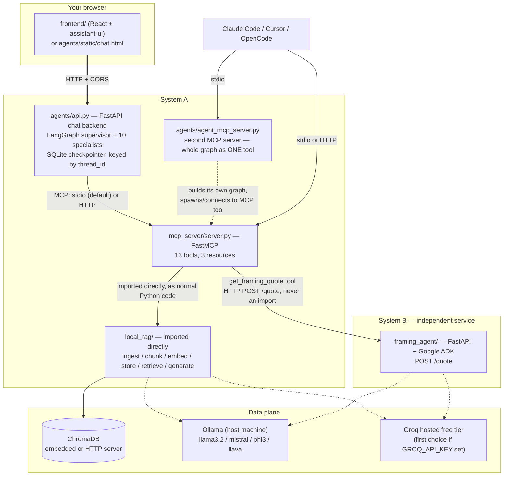
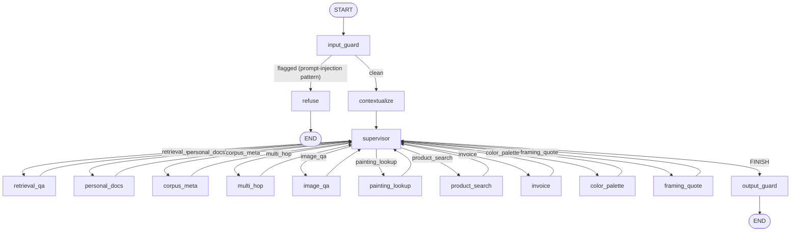

# InMind — Multi-Agent RAG System for Art & Painting Treatises

A multi-agent question-answering system built on top of a Retrieval-Augmented
Generation (RAG) pipeline over historical painting and drawing treatises.
Runs entirely on your own machine by default (local Ollama models, ChromaDB),
with an optional, free-tier **Groq** backend that every reasoning/generation/
vision call tries first when configured. No paid APIs are required anywhere
in the stack: Groq's free tier needs no card, and leaving `GROQ_API_KEY`
unset makes the whole system behave exactly as it did before Groq was added
— fully local, no network calls.

This README covers the **whole project** — all five services, how they fit
together, and how to run the entire stack from a clean checkout. Individual
folders also carry their own, more detailed READMEs (`local_rag/README.md`,
`agents/README.md`, `mcp_server/README.md`, `framing_agent/README.md`,
`frontend/README.md`, `docs/DOCKER.md`) — see [§13](#13-further-reading).

> **A note on accuracy.** Several claims in the previous version of this
> README, and in some of the per-folder READMEs, had drifted from what the
> code actually does — a stale specialist count, a broken module invocation,
> a port mismatch, model names Groq has since deprecated. This revision was
> checked directly against the source (`agents/specialists.py`,
> `agents/supervisor.py`, `local_rag/config.py`, `local_rag/pipeline.py`,
> `docker-compose.yml`, the Dockerfiles, and `.github/workflows/ci.yml`)
> rather than carried forward from the old text. Where something couldn't be
> verified without actually running the stack, it's called out as such in
> [§11](#11-known-limitations) instead of stated as fact.

---

## 1. What This Is

The project has three layers stacked on top of each other, a chat interface
on top of all of them, and one genuinely independent side-service:

- **`local_rag/`** — the RAG engine. Ingests a corpus of historical art and
  painting treatises (text, PDF, image), chunks and embeds it, stores it in
  a vector database, and answers questions by retrieving relevant passages
  and generating an answer — Groq's hosted free tier first if
  `GROQ_API_KEY` is set, a local Ollama model otherwise or on any Groq
  failure. It also doubles as a full benchmarking harness (chunking,
  embedding, retrieval, generation, quantization, VLM strategies), most of
  which is exploratory and not wired into the production path — see
  [§5](#5-project-layout).
- **`mcp_server/`** — wraps `local_rag/` as a set of thirteen named tools
  and three resources using the Model Context Protocol (MCP), so anything
  that speaks MCP (this project's own agents, or an external tool like
  Claude Code, Cursor, or OpenCode) can use the pipeline without importing
  its code directly.
- **`agents/`** — a multi-agent system built with LangGraph. A supervisor
  reads each question and routes it to one of **ten** specialists (not
  seven — see [§4](#4-the-ten-specialists)), bracketed by input/output
  guardrails, with a persistent chat API on top. `agents/` also exposes a
  **second** MCP server (`agent_mcp_server.py`) that wraps the entire
  guarded, routed pipeline as a single tool — deliberately kept separate
  from `mcp_server/`'s raw primitives; see [§10](#10-technical-decisions-and-justifications).
- **`frontend/`** — a browser chat interface: a React/assistant-ui app
  (`frontend/`), plus a simpler single-file HTML page (`agents/static/chat.html`)
  served by the backend itself. Both talk to the same `agents/api.py`
  endpoints. Includes a usage badge showing remaining Groq free-tier
  request budget per model.
- **`framing_agent/`** — **"System B"**: a genuinely independent HTTP
  microservice (FastAPI + Google's Agent Development Kit) that prices
  framing, glazing, and shipping for a *finished* artwork. It shares no
  code, no process, and no framework with the four services above —
  `mcp_server/framing_tools.py` reaches it only over plain HTTP, exactly
  the way you would with any third-party API. It can be started, stopped,
  or redeployed independently of everything else.

Local by default, free either way: with no `GROQ_API_KEY` set, everything
runs on Ollama for generation, HF's `sentence-transformers/all-MiniLM-L6-v2`
for embeddings, and ChromaDB for storage — no network calls at all. Setting
`GROQ_API_KEY` (free, no card, from https://console.groq.com/keys) makes
every reasoning/generation/vision call in **both** System A and System B try
Groq's hosted free tier first, automatically falling back to the same local
model on any failure (missing key, network error, rate limit, or a
deprecated-model 404 — see [§11](#11-known-limitations)).

---

## 2. Who This Is For

- **Someone standing up the whole system** to actually chat with it about
  painting technique, look up a specific artwork, shop for art supplies,
  get an invoice, generate a color palette, or price framing and shipping
  for a finished piece.
- **A developer extending or grading one layer** of a project built to
  demonstrate specific architectural disciplines: MCP as the *only* path
  from agent code to retrieval, validated (not just prompted) routing,
  structural guardrails that don't depend on an LLM behaving itself, two
  independently-deployable services cooperating over plain HTTP instead of
  a shared import, and a paid → free-hosted → local → deterministic
  fallback chain for every LLM call.
- **An MCP-native coding assistant user** (Claude Code, Cursor, OpenCode)
  who wants to point their client at either MCP server and query the
  corpus, or the whole guarded pipeline, from inside their editor.

It is **not** built for multi-tenant production deployment as-is: there is
no authentication anywhere in the stack, chat history is a single local
SQLite file, and several tools (invoice generation, internet search) are
reachable by anyone who can reach the relevant port. See
[§11](#11-known-limitations) for the complete list.

---

## 3. Architecture

### 3.1 Services and how they talk to each other



Plain-text version, if Mermaid doesn't render wherever you're reading this:

```
Browser (frontend/ or chat.html)
        |  HTTP + CORS
        v
agents/api.py  (FastAPI, LangGraph supervisor + 10 specialists, SQLite history)
        |  MCP (stdio by default, HTTP in Docker)
        v
mcp_server/server.py  (13 tools, 3 resources)
        |  imported directly, normal Python
        v
local_rag/  (ingest -> chunk -> embed -> store -> retrieve -> generate)
        |                       |
        v                       v
   ChromaDB              Ollama (host) <-- tried second
                          Groq hosted   <-- tried first, if GROQ_API_KEY set

mcp_server/framing_tools.py --HTTP POST /quote--> framing_agent/ (System B)
                                                    |
                                                    v
                                          Groq -> Ollama -> fixed template

Claude Code / Cursor / OpenCode --stdio or HTTP--> mcp_server/server.py
                                 --stdio----------> agents/agent_mcp_server.py
```

Two MCP servers exist on purpose and are never merged: `mcp_server/server.py`
exposes *raw* retrieval/tool primitives with no routing and no guardrails;
`agents/agent_mcp_server.py` exposes one tool, `ask_multi_agent_rag`, that
runs a question through the entire guarded, routed pipeline. See
[§10](#10-technical-decisions-and-justifications) for why.

### 3.2 A question's path through the agent graph



`input_guard` blocks unsafe or oversized input (regex prompt-injection
patterns, an excessive-length check) before anything else runs — no LLM
call is spent on a flagged turn. `contextualize` rewrites a vague follow-up
("what about the second one?") into a standalone question using recent
history. `supervisor` picks the next specialist or decides the turn is
done, validated three independent ways (see [§10](#10-technical-decisions-and-justifications))
and bounded by `DEFAULT_ITERATION_CAP = 9`. Every specialist edges back only
to `supervisor` — never to `END`, never to another specialist directly —
which is what makes the iteration cap a meaningful, enforceable count of
visits to one node. `output_guard` scans every message produced since the
user's last turn for structured PII and unapproved link domains before the
answer goes out.

---

## 4. The Ten Specialists

The system currently routes to **ten** specialists. (Some older
documentation in this repo — including a previous version of this file —
only lists seven; `personal_docs`, `color_palette`, and `framing_quote`
were added later without every doc catching up. This table was read
directly from `agents/specialists.py`'s `build_specialists()`.)

| Specialist | Tools it's bound to | LLM calls | Purpose |
|---|---|---|---|
| `retrieval_qa` | `retrieve`, `generate_answer` (agentic loop) | Yes — `create_react_agent`, always the large tier | Cite-backed Q&A over the corpus |
| `personal_docs` | `search_personal_documents` (scoped to this thread's uploads) | Yes, one call | Answers about a file *you* uploaded into this conversation |
| `corpus_meta` | none — static document list baked in at build time | Yes, one call | "What documents are in your corpus?" |
| `multi_hop` | `retrieve` ×2 (fixed shape) | Yes, three calls (decompose, then synthesize) | Splits a compound question into two topics and combines the answers |
| `image_qa` | `retrieve_images`, `find_similar_images` | **Zero** | Shows corpus images, or finds corpus images similar to an upload |
| `painting_lookup` | `retrieve`, `search_painting_online` (fixed shape) | Yes, one call | Named-painting lookup, corpus + live web/Wikipedia |
| `product_search` | `search_art_supplies` | Yes, one call | Real, purchasable art-supply search, split into beginner/professional tiers |
| `invoice` | `generate_invoice` | **Zero** | Itemized invoice from prior `product_search` results earlier in this chat |
| `color_palette` | `generate_color_palette` | **Zero** | A palette from a color name, hex code, or mood |
| `framing_quote` | `get_framing_quote` | Yes, one call (or asks for missing details) | Framing + shipping cost estimate — calls out to System B over HTTP |

Three specialists (`image_qa`, `invoice`, `color_palette`) make **zero** LLM
calls at all — every number, caption, or hex code they show comes straight
out of a tool's own structured return value, so they cannot hallucinate one
even in principle. `corpus_meta` makes one call but is given no tools at
all, so it cannot fabricate anything about document *content* — only the
corpus's own document list, fetched once and baked into its system prompt.
This "structural guardrail, not a prompt instruction" pattern is used
throughout — see [§10](#10-technical-decisions-and-justifications).

---

## 5. Project Layout

```
project-root/
├── local_rag/
│     ├── ingestion/, chunking/, embeddings/, vectorstore/,
│     ├── retrieval/, generation/, safety/, evaluation/
│     ├── slm/, quantization/, vlm/, serving/   (benchmarking harness, not wired into production)
│     ├── config.py       single source of truth for every model name/path in the project
│     ├── pipeline.py     CLI: ingest / ask / clear   (run from INSIDE local_rag/, see §6.6)
│     ├── stages.py       run the six pipeline stages independently, disk-checkpointed
│     └── api.py          REST API for local_rag alone: POST /ingest, POST /query, GET /documents
│
├── mcp_server/
│     ├── server.py            FastMCP app, 13 tools + 3 resources, all startup wiring
│     ├── image_tools.py, web_tools.py, invoice_tools.py, color_tools.py, framing_tools.py
│     ├── test_new_tools_smoke.py, test_langgraph_client.py
│     └── generated_invoices/  output of generate_invoice(), gitignored except .gitkeep
│
├── agents/
│     ├── state.py, prompts.py, mcp_client.py
│     ├── specialists.py, supervisor.py, contextualize.py
│     ├── guardrails.py, graph.py, api.py
│     ├── agent_mcp_server.py   second MCP server — whole graph as one tool
│     ├── eval_routing.py, eval_language.py, eval_phase5.py
│     ├── mcp_config.example.json, opencode.example.json
│     ├── static/chat.html      plain HTML chat UI, served by api.py itself
│     └── test_*.py             (eighteen files — see §9)
│
├── frontend/
│     ├── index.html, vite.config.ts, tsconfig.json
│     └── src/
│           ├── api.ts, runtime.ts, types.ts, attachments.ts
│           └── components/  Thread.tsx, Message.tsx, Composer.tsx,
│                             ChatHistory.tsx, ToolSelector.tsx, UsageBadge.tsx, MarkdownText.tsx
│
├── framing_agent/                (System B — independent service)
│     ├── agent.py    Google ADK agent: wraps compute_quote as a tool, writes the explanation
│     ├── pricing.py  all pricing arithmetic — zero LLM calls, zero external imports
│     └── server.py   FastAPI: GET /health, GET /.well-known/agent.json, POST /quote
│
├── docker/            one Dockerfile per service, plus shared.Dockerfile (see §11) and nginx.conf
├── docs/DOCKER.md     the full Docker reference (manual method, troubleshooting, env var table)
├── docker-compose.yml
├── .env.example, env.docker.example
├── .mcp.json           example MCP client config (local-rag + multi-agent-rag servers)
├── run_all_evaluations.py   one entry point for agents/'s three eval_*.py scripts
└── CHANGELOG_EXTENSIONS.md  history of what was added on top of the original 3-specialist submission
```

`local_rag/config.py` is the single source of truth for every path and
model name used anywhere in System A; nothing else hardcodes one.
`framing_agent/` (System B) deliberately does **not** read `config.py` —
it has its own environment variables (`FRAMING_AGENT_GROQ_MODEL`,
`FRAMING_AGENT_OLLAMA_MODEL`), reinforcing that it is a genuinely separate
codebase, not a second entry point into the same one.

---

## 6. Setup — Running Locally (No Docker)

This is the fastest path to a working system on one machine. If you'd
rather run everything in containers, skip to [§7](#7-setup--running-with-docker).

### 6.1 Prerequisites

- Python 3.10+ (the project was built and tested against 3.12)
- [Ollama](https://ollama.com), running locally (`ollama serve`)
- Node.js 18+ and npm — only needed for the React frontend; the plain HTML
  chat page needs neither
- *Optional:* a free [Groq](https://console.groq.com/keys) API key
- *Optional:* a paid [Together AI](https://api.together.ai/settings/api-keys)
  key — a second hosted fallback for small/routing-tier calls only

### 6.2 Pull the required local models

```bash
ollama pull llama3.2     # large-tier reasoning/generation (default)
ollama pull mistral       # small-tier reasoning (tool-calling capable)
```

Text **embedding** does not need an Ollama pull: the production
configuration selected after a real evaluation (see `local_rag/README.md`)
is the Hugging-Face `sentence-transformers/all-MiniLM-L6-v2` model, which
downloads automatically the first time it's used and is installed via pip
in the next step. (`nomic-embed-text` / `mxbai-embed-large` are available
as Ollama-backed alternatives if you want to benchmark them, but are not
the default — pull them only if you plan to pass `--embedder ollama`.)

If you want image search / image-to-image retrieval (`image_qa`), also
pull a vision model for live caption fallback:

```bash
ollama pull llava        # or: ollama pull moondream (smaller, CPU-friendly)
```

### 6.3 Install Python dependencies

There is **no root-level `requirements.txt`** — install each layer's own
file. From the project root:

```bash
pip install -r local_rag/requirements.txt
pip install -r mcp_server/requirements.txt
pip install -r agents/requirements.txt
pip install -r agents/requirements-api.txt   # needed for the FastAPI chat server
```

(`agents/requirements.txt` and `agents/requirements-api.txt` are each
explicitly additive — install both, plus `local_rag/`'s and
`mcp_server/`'s own files above, not just one of them.) If you plan to run
`framing_agent/` too, it has its own, separate `requirements.txt` — see
[§6.11](#611-optional-framing_agent-system-b).

### 6.4 Configure environment variables

Create a `.env` file at the project root (there's an `.env.example` to
start from, though it only lists two of the variables below — add the
others by hand if you need them):

```
GROQ_API_KEY=your_groq_api_key_here
TOGETHER_API_KEY=your_tgp_api_key_here
```

Every variable is optional; leaving all of them unset runs the whole
system fully local. See [§7.4](#74-environment-variables-reference) for
the complete list, including ones only relevant under Docker.

### 6.5 Optional: Groq (and Together AI)

Every reasoning, RAG-generation, and vision call in this project tries
Groq's hosted free tier first, when configured, and falls back to the
exact same local Ollama model automatically on any failure — missing key,
network error, rate limit, **or a deprecated-model 404** (see
[§11](#11-known-limitations); this is not hypothetical, it has already
happened once to the models this project originally shipped with).

1. Get a free key (no card required) at https://console.groq.com/keys.
2. Add it to `.env` as `GROQ_API_KEY=...` (see above).
3. Restart whichever process picks it up (`agents/api.py`,
   `mcp_server/server.py`, and — if you're running it — `framing_agent/`,
   which reads the same key independently).

Current free-tier request/token limits per model:
https://console.groq.com/docs/rate-limits. The chat UI shows a small badge
with how much of the daily budget is left, per model.

`TOGETHER_API_KEY` is a separate, **paid** (not free-tier) fallback used
only for small/routing-tier calls, because the supervisor and several
specialists' routing calls share one low Groq token-per-minute ceiling and
can exhaust it within seconds of each other in a single turn. Entirely
optional — nothing breaks if you never sign up.

### 6.6 Ingest the corpus

Place source treatises (PDF/text/image files) in `local_rag/data/raw/`,
then run the pipeline **from inside `local_rag/`** — its modules use flat
imports (`from config import ...`, `from ingestion.loader import ...`)
with no path shims, so `python -m local_rag.pipeline ingest` from the
project root will fail with `ModuleNotFoundError: No module named
'ingestion'`. Run it as a script instead:

```bash
cd local_rag
python pipeline.py ingest --source data/raw --embedder hf --store chroma
```

Add `--multimodal` if you want `image_qa` and the image-similarity tools
to work at all — without it, `retrieve_images*` and `find_similar_images*`
always return an empty list, silently, rather than an error. Re-running
this command is safe: pass `--incremental` and only new or changed files
(tracked by a content-hashed manifest) get re-processed.

A one-off question directly against the pipeline, useful as a sanity check
before starting any server:

```bash
python pipeline.py ask "What pigments were used for ultramarine?" \
    --embedder hf --store chroma --generator ollama --rerank
```

### 6.7 Start the MCP server (optional, standalone)

```bash
cd project-root   # back to the project root
python mcp_server/server.py
```

This is normally spawned automatically, as a stdio subprocess, by
`agents/mcp_client.py` — you don't need to run it by hand unless you're
connecting an external MCP client (Claude Code, Cursor, OpenCode) directly
to the *raw* server, or want it reachable over a network port:

```bash
MCP_TRANSPORT=http python mcp_server/server.py
# now listening at http://0.0.0.0:8765/mcp
```

### 6.8 Start the chat backend

```bash
python -m agents.api
```

This builds the LangGraph agent graph once at startup and keeps it alive
for the whole process, backed by a SQLite checkpointer so conversation
history survives across requests and restarts. It listens on
`127.0.0.1:8001` by default — the same default the frontend expects (see
[§6.9](#69-run-the-frontend)).

> **If you'd rather invoke uvicorn directly**, pass the port explicitly:
> `uvicorn agents.api:app --reload --port 8001`. Leaving `--port` off
> defaults to uvicorn's own port 8000, which will silently mismatch the
> frontend's default `8001` and every `curl` example in this README.

### 6.9 Try it without a frontend

Open `http://localhost:8001/` in a browser — `agents/api.py` serves
`agents/static/chat.html` itself, no separate process needed — or send a
request directly:

```bash
curl -X POST http://localhost:8001/chat \
  -H "Content-Type: application/json" \
  -d '{"message": "What did Cennini say about tempera grounds?"}'
```

### 6.10 Run the React frontend

```bash
cd frontend
npm install
npm run dev
```

Open `http://localhost:5173`. The app falls back to
`http://localhost:8001` for the backend if nothing else is configured; if
your backend runs elsewhere, create `frontend/.env.local`:

```
VITE_API_BASE_URL=http://localhost:8001
```

The frontend can be started and browsed **before** a backend exists —
every control renders, and sending a message fails visibly with a clear
"Couldn't reach the agent API..." message rather than hanging.

### 6.11 Optional: framing_agent (System B)

`framing_quote` (the specialist) and `get_framing_quote` (the MCP tool)
both degrade cleanly to "unavailable" if this isn't running — nothing else
breaks. To bring it up:

```bash
cd framing_agent
python3 -m venv .venv && source .venv/bin/activate   # Windows: .venv\Scripts\activate
pip install -r requirements.txt
cat > .env << 'EOF'
GROQ_API_KEY=your_key_here
OLLAMA_HOST=http://localhost:11434
PORT=8090
EOF
uvicorn server:app --host 0.0.0.0 --port 8090
```

Every field in that `.env` is optional — with none set, `/quote` still
returns a full priced quote on every call, falling back to a fixed-string
template explanation instead of an LLM-written one. Point `mcp_server/` at
it (only needed if it's not on the default):

```bash
export FRAMING_AGENT_URL=http://localhost:8090
```

Verify:

```bash
curl http://localhost:8090/health
curl -X POST http://localhost:8090/quote \
  -H "Content-Type: application/json" \
  -d '{"width_cm": 40.6, "height_cm": 50.8, "medium": "oil on canvas", "destination_country": "France"}'
```

### 6.12 Connect an MCP client (Claude Code / Cursor / OpenCode)

`.mcp.json` at the project root already registers both servers — edit the
paths to match your own checkout, or use it as-is if you're running Claude
Code from this directory:

```json
{
  "mcpServers": {
    "local-rag": {
      "command": "python",
      "args": ["/absolute/path/to/project-root/mcp_server/server.py"]
    },
    "multi-agent-rag": {
      "command": "python",
      "args": ["/absolute/path/to/project-root/agents/agent_mcp_server.py"]
    }
  }
}
```

`local-rag` gives raw retrieval tools with no routing or guardrails;
`multi-agent-rag` exposes one tool, `ask_multi_agent_rag`, that runs a
question through the entire guarded, routed pipeline and returns
`{answer, blocked, specialists_visited, iteration_count}`. Registering
both under one client lets you compare a raw retrieval answer against the
guarded agent's answer to the same question. Use an **absolute path** —
the three clients don't all set the working directory the same way.
`agents/mcp_config.example.json` and `agents/opencode.example.json` are
ready-to-edit copies of the same shape.

---

## 7. Setup — Running with Docker

`docker-compose.yml` at the project root brings up all five System-A/B
containers plus Chroma. This section covers the essentials; the full
manual (non-compose) method, a complete troubleshooting guide, and the
full environment-variable reference live in **`docs/DOCKER.md`** — read
that file if compose doesn't work for your setup or you want to build and
run each container by hand.

### 7.1 What gets built

```
chroma-server (8000, published as 8002) <-- mcp-server (8765) <-- backend (8001) <-- frontend (8080, nginx)
      ^_________________________________________________________________|
                                                                          |
                                                          framing-agent (8090) -- independent, no depends_on
```

- **chroma-server** — owns the one Chroma connection; both `mcp-server`
  and `backend` reach it over HTTP.
- **mcp-server** — `mcp_server/server.py` over `MCP_TRANSPORT=http`
  instead of stdio.
- **backend** — `agents/api.py`, talks to `mcp-server` and `chroma-server`
  over HTTP.
- **frontend** — the built React app served by nginx, which proxies
  `/api/` to `backend:8001` — the browser never talks to `backend`
  directly under compose, unlike the non-Docker setup in §6.
- **framing-agent** — System B, its own container, no `depends_on`
  relationship to anything else. Skip it entirely and every other service
  keeps working; `get_framing_quote` just reports itself unavailable.

**Ollama is not containerized.** Every container reaches your host's
`ollama serve` via `OLLAMA_HOST` (default
`http://host.docker.internal:11434`) — nothing here changes how Ollama
itself runs, and Ollama's own pulled models are never touched by Docker.

### 7.2 Run it

```bash
cp env.docker.example .env
docker compose up --build
```

Edit `.env` first if `OLLAMA_HOST` needs to point somewhere other than
`http://host.docker.internal:11434`, or if any default port
(`BACKEND_PORT`, `FRONTEND_PORT`, `MCP_SERVER_PORT`, `CHROMA_SERVER_PORT`)
collides with something already running on your machine. Every value in
`env.docker.example` already has a working default baked into
`docker-compose.yml` — a `.env` file is only needed if you want to change
one of them.

`depends_on: condition: service_healthy` means compose waits for
`chroma-server` (and `mcp-server`, for `backend`) to pass its healthcheck
before starting the next service — this avoids a real, confirmed startup
race where `backend` calls `mcp-server` to fetch its tool list before
`mcp-server`'s heavy ML imports have finished loading.

Open `http://localhost:8080` once everything is healthy (`docker compose
ps`). Tear down with `docker compose down` (keeps volumes — chat history,
corpus, uploads) or `docker compose down -v` (also deletes them).

### 7.3 Model weights: what Docker downloads vs. persists

Two different kinds of "local model," treated differently:

- **Ollama models** (`llama3.2`, `mistral`, `llava`, ...) are **not
  touched by Docker at all** — they live on your host, pulled the normal
  way, and every container just makes HTTP calls to `OLLAMA_HOST`.
- **Hugging Face models** (the embedder and reranker) download the first
  time a container actually uses them (~90MB combined) and are cached in
  a shared `hf-cache` volume so the download happens once total, not once
  per container recreation.

### 7.4 Environment variables reference

The full table (30+ variables, including every System-B-specific one)
lives in `docs/DOCKER.md`. The ones you're most likely to actually touch:

| Variable | Default | Purpose |
|---|---|---|
| `OLLAMA_HOST` | `http://localhost:11434` (non-Docker) / `http://host.docker.internal:11434` (Docker) | Where every container reaches your host's Ollama server |
| `GROQ_API_KEY` | unset | Same key, used independently by `mcp-server`/`backend` **and** `framing-agent`. Unset → everything falls back to local Ollama |
| `TOGETHER_API_KEY` | unset | Optional second hosted fallback, small-tier calls only |
| `GEMINI_API_KEY` | unset | Optional online VLM backend for single-image personal uploads — unrelated to `framing-agent`, which uses Groq/Ollama, not Gemini |
| `CHROMA_CLIENT_MODE` | `embedded` | `embedded` = local `PersistentClient` (non-Docker default); `http` = talk to a separate Chroma server (Docker default) |
| `MCP_TRANSPORT` | `stdio` | `stdio` = spawn `mcp_server/server.py` as a subprocess (non-Docker default); `http` = real network port (Docker default) |
| `AGENT_API_HOST` / `AGENT_API_PORT` | `127.0.0.1` / `8001` | `0.0.0.0` is required inside a container |
| `AGENT_API_CORS_ORIGINS` | `http://localhost:5173,...` | Must include wherever the frontend is actually reachable in the browser |
| `FRAMING_AGENT_URL` | `http://localhost:8090` | System B's base URL, as seen by `mcp_server/framing_tools.py`; `http://framing-agent:8090` under compose |
| `FRAMING_AGENT_GROQ_MODEL` / `FRAMING_AGENT_OLLAMA_MODEL` | `llama-3.3-70b-versatile` / `llama3.2` | System B's own model config, independent of System A's `config.py` — see [§11](#11-known-limitations) on the Groq default here being stale |

Every variable keeps its exact original default; none of this changes
non-Docker behavior unless explicitly set.

---

## 8. Testing

Two tiers of tests exist throughout the project:

```bash
# Fast offline smoke tests (fake LLM and fake tool responses, no dependencies)
pytest agents/ mcp_server/ -k smoke --ignore=agents/test_llm_provider_smoke.py --asyncio-mode=auto

# Live tests against a real Ollama model and the real corpus
python test_specialists_live.py
```

The Groq integration's own smoke tests mock `requests.post` (no live Groq
key, no network, no running Ollama needed) and are run directly rather
than through the sweep above, since they mix sync and async tests:

```bash
python -m agents.test_llm_provider_smoke      # agents/llm_provider.py + agents/tracing.py
cd local_rag && python test_groq_integration_smoke.py   # groq_client.py, usage_tracker.py,
                                                          # fallback_generator.py, fallback_vlm.py
```

Sanity-check `agents/` on its own (compiles + runs the real `StateGraph`
with a faked LLM and MCP client — catches routing/graph-wiring bugs
without needing Ollama, Groq, or a real corpus running):

```bash
python -m agents.test_graph_smoke
python -m agents.test_supervisor_smoke
python -m agents.test_guardrails_smoke
python -m agents.test_api_smoke
```

If these four pass but a real end-to-end question fails, the problem is
almost certainly in your environment (Ollama not running, corpus not
ingested, `mcp_server/server.py` not found, missing API keys), not in this
code.

`mcp_server/`'s own offline smoke test needs no live network, corpus, or
Ollama — it monkeypatches `ddgs`/`requests` and exercises the real
parsing/filtering logic against fake responses:

```bash
python mcp_server/test_new_tools_smoke.py
```

Run the full routing/language/answer-quality evaluation harness (all
three `agents/eval_*.py` scripts, run the way each one's own docstring
specifies):

```bash
python run_all_evaluations.py
```

`local_rag/`'s own RAGAS-based evaluation suite (faithfulness, relevance,
precision, recall against a local Ollama judge — no OpenAI key needed) is
separate and not wrapped by the above:

```bash
cd local_rag && python -m evaluation.ragas_eval
```

The CI workflow (`.github/workflows/ci.yml`) runs the smoke-test tier, the
frontend's `typecheck` + `build`, and builds (and, on `main`, publishes)
all five Docker images — a useful reference for exactly which commands are
considered "must pass."

`framing_agent/` has **no automated test suite** — only manual
`if __name__ == "__main__":` smoke-checks inside `pricing.py` and
`agent.py`. This is a stated gap, not an oversight (see
[§11](#11-known-limitations)).

---

## 9. Technical Decisions and Justifications

**MCP as the only path from agent code to retrieval.** No specialist
imports `retrieval/`, `generation/`, `embeddings/`, etc. directly — every
one talks to `mcp_server/server.py` exclusively through
`langchain-mcp-adapters`. This is what lets an external MCP client and
this project's own agent graph provably hit the same retrieval code path,
rather than two implementations that can silently drift apart.

**Two MCP servers, kept separate rather than merged.**
`mcp_server/server.py` exposes raw primitives with no routing or
guardrails; `agent_mcp_server.py` exposes one guarded, routed tool.
Folding the second into the first would mean one server spawning a
subprocess of itself to answer its own tool call, and would blur what the
raw server is meant to demonstrate.

**Ten genuinely different specialist shapes, not ten copies of the same
agent.** `retrieval_qa` is a real `create_react_agent` because deciding
whether one `retrieve()` call was enough is exactly the kind of judgment
call that shouldn't be hardcoded. `multi_hop` and `painting_lookup` are
explicit, fixed-shape Python instead, because their iteration count needs
to be knowable in advance once the supervisor is counting visits against a
shared cap. `image_qa`, `invoice`, and `color_palette` use **zero** LLM
calls, because every value they display is already structured data
returned by a tool.

**Validated routing — three independent checks, not one prompt
instruction.** The supervisor's LLM is constrained to a Pydantic
`RouteDecision` with a `Literal[...]` route field. (1) Schema validation
rejects a hallucinated name outright. (2) A separate membership check
against the *actual* specialists dict the graph was built with catches a
Literal that's drifted out of sync with what's really registered. (3) A
repeat-route guard rejects even a schema-valid, known route if that
specialist has already answered this turn — added after a confirmed live
run showed a local model validly, repeatedly choosing the same specialist
despite an explicit prompt instruction not to.

**Structural guardrails over prompt-only guardrails, applied
consistently.** `corpus_meta`'s zero-tool design, `retrieval_qa`'s direct
extraction of the tool's own cited output instead of trusting the model's
paraphrase, and the two guard nodes (`input_guard`, `output_guard`) never
call an LLM. They reuse `local_rag/safety/`'s regex modules and plain
Python, on the theory that a check a model can silently ignore isn't a
check.

**Groq → Together → local Ollama, chosen per call, inside one
`BaseChatModel`.** `llm_provider.py`'s fallback model tries Groq first for
every reasoning call site, adds one more hosted hop (Together) for
small/routing-tier calls specifically, and falls back to local Ollama
either way — done *inside* one chat-model class rather than picked once at
startup, so degradation is genuinely per-call.

**Iteration cap sized mechanically from the route count, not guessed.**
`DEFAULT_ITERATION_CAP = 9` (for ten specialists) is derived from the
repeat-route guard's own worst case: walking every untried specialist once
before force-`FINISH`ing, plus one buffer call to land on `FINISH`
normally — a formula, not an independently-tuned constant.

**Two frameworks, one HTTP boundary, never an import (System B).** System
A is LangGraph; `framing_agent/` is Google ADK. The only contract between
them is the JSON shape of `POST /quote`, so either side can be developed,
deployed, or restarted independently — the same way a checkout flow calls
a third-party shipping API rather than vendoring its code.

**The LLM never touches a price.** `framing_agent/pricing.py` has zero LLM
calls and zero imports from anywhere else in the project. Its ADK agent is
instructed to call the pricing tool exactly once and only write narration
around the number it returns — a structural guarantee, not a prompting
hope, since the model has no other source of a price to invent one from.

**Every outbound web link is checked against a small, hand-curated domain
allowlist**, at both the source (each internet-facing tool filters its own
results) and the sink (`output_guard` re-checks independently) — cheap
insurance against a link being altered somewhere in between.

**Invoice totals and color math are plain Python, never an LLM call.**
Every line total, subtotal, hex/RGB conversion, and hue rotation is
deterministic arithmetic; a model can decide *which* items belong on an
invoice, but never what the numbers add up to.

**A real LangGraph checkpointer (SQLite) for the chat API, not
rebuild-everything-per-call.** `agents/graph.py`'s CLI path builds a fresh
graph on every call — fine for one-off questions, wrong for a chatbot,
since `invoice` specifically reads prior `product_search` messages back
out of persisted conversation state. `agents/api.py` instead compiles one
graph once, with `AsyncSqliteSaver`, threaded by `thread_id`.

**A themed, hand-built frontend, not a generic dark-mode template.** The
React app composes assistant-ui's headless primitives directly rather than
pulling a pre-built `Thread` component from its component registry — no
Tailwind config to fight when restyling, and no dependency on that
registry being reachable. Editing a message branches a new `thread_id`
rather than mutating history in place, mirroring the sidebar's existing
"branch conversation" action instead of introducing a second kind of
history mutation.

---

## 10. Known Limitations

Documented tradeoffs and real gaps, stated directly rather than glossed
over — a report that names these is worth more than one that quietly
works around them.

**Cross-cutting / whole-system:**

- **No authentication anywhere in the stack.** Every HTTP surface — the
  chat API, the MCP HTTP transport, System B's `/quote` — is open to
  anyone who can reach the port. Fine for local development or a trusted
  Docker network; not something to expose publicly as-is.
- **No streaming.** `POST /chat` (and `/retry`, `/edit`) block until the
  supervisor loop reaches `FINISH` or the iteration cap forces a partial
  answer; the reply appears all at once.
- **Local small-model routing is genuinely unreliable**, which is why
  three separate safety nets exist around it (§9) rather than one. Live
  runs showed a local model repeatedly choosing the same route regardless
  of a changing transcript.
- **Guardrails are regex-based, not semantic.** A rephrased or obfuscated
  prompt-injection attempt can slip past `input_guard`; unstructured PII
  written in plain prose (a name or address, not an email/phone/SSN/card
  shape) will not be caught by `output_guard`.
- **`docker-compose.yml` and the CI workflow build from different
  Dockerfiles for the same two services.** `docker/shared.Dockerfile` is a
  newer, unified multi-stage file (its own header explains it replaced two
  independently-maintained files that had drifted from each other, causing
  real crash-loops). `.github/workflows/ci.yml` already builds `backend`
  and `mcp-server` from `shared.Dockerfile`, but `docker-compose.yml`
  still points both at the old, separate `docker/backend.Dockerfile` and
  `docker/mcp_server.Dockerfile`. Both should currently work, but they are
  not guaranteed to stay in sync with each other, and `docs/DOCKER.md`'s
  manual-method instructions describe the newer shared-file build, not
  what compose actually runs.
- **`Project_Status_Report.docx` / `Multi_Agent_Pipeline_Report.pdf`**,
  referenced by earlier documentation in this repo as "the authoritative
  reference" for the full design history, is **not present** in this
  checkout — only `local_rag/REPORT_TEMPLATE.md`, a template, exists.
  Treat every "see the report" pointer in this README and the per-folder
  READMEs as aspirational unless that file has been added back.

**`local_rag/` (RAG engine):**

- `search_art_supplies` prices are read from search-result snippets, not
  a live pricing lookup, and can be stale or missing.
- The `structure_aware` chunker has a known bug on at least one real
  corpus page (one 85,938-word chunk against an average of 395), pointing
  to a page-extraction problem rather than the chunking rule itself.
- Scanned-PDF OCR and whole-page VLM description add real, non-trivial
  latency and are opt-in flags, not the default ingest path.

**`mcp_server/`:**

- **`policy://tool-status` currently raises an error** — its
  `image_search` sub-field calls a function `image_tools.py` doesn't
  define. The per-module `available`/`unavailable` fields on the same
  resource are unaffected.
- **The BM25 corpus is a startup-time snapshot.** Re-ingesting documents
  while the server is running won't be reflected in `retrieve()` until the
  process restarts, even though `corpus://documents` always reflects the
  live store.
- `retrieve_images*`/`find_similar_images*` need a `--multimodal` ingest;
  without it they silently return `[]`, indistinguishable from "nothing
  found."
- No authentication on the HTTP transport; `ddgs` (used for web search)
  has no SLA and can rate-limit or change shape without notice.
- Test coverage is uneven — `color_tools.py`, `framing_tools.py`,
  `personal_rag.py`, and the core `retrieve`/`generate_answer` path have
  no smoke-test coverage at all.

**`agents/`:**

- **This folder is not self-contained.** Several modules import from
  sibling packages (`config.py`, `personal_rag.py`, `usage_tracker.py`,
  `groq_client.py`, `together_client.py`, `local_rag/safety/`) one level
  up — it must sit alongside `local_rag/` and `mcp_server/`, not be
  extracted on its own.
- `agent_mcp_server.py` rebuilds the whole graph (and re-spawns
  `mcp_server/server.py`, re-warming its embedder) on every single tool
  call — no caching, no persistent connection reuse.
- The chat API's persistence is a single local SQLite file — not
  multi-process-safe.
- Most specialists only read the latest message as their question, not
  the full conversation; `invoice` is a deliberate exception.
- `create_react_agent` (used for `retrieval_qa`) is deprecated as of
  LangGraph 1.0 in favor of `langchain.agents.create_agent`, though it
  still works through at least LangGraph 1.2.x.

**`frontend/`:**

- Thread identity is a client-generated UUID in `localStorage` — anyone
  who can reach the backend and guess/read a `thread_id` can read,
  continue, or delete that conversation.
- Removing an attachment from the composer is client-side only; by the
  time it's removable, it's very likely already uploaded and ingested into
  the backend's per-thread collection.
- `UsageBadge.tsx`'s tracked-model list is a hardcoded array that has to
  be kept in sync by hand with the backend's actual Groq model config —
  and, as of this revision, does not match the current model names in
  `local_rag/config.py` (see the Groq-model-deprecation note below).
- No automated component/e2e test suite; `npm run typecheck` is a static
  check only.

**`framing_agent/` (System B):**

- **All pricing is invented for coursework** — clearly labelled via the
  response's own `disclaimer` field, not a real framing shop's or
  carrier's rate card.
- The shipping-zone table covers ~20 countries; anything else silently
  defaults to the most expensive "international" tier.
- Frame-style matching is a simple substring match, not real fuzzy
  matching.
- No authentication, rate limiting, HTTPS, or automated test suite.
- **`FRAMING_AGENT_GROQ_MODEL`'s documented default
  (`llama-3.3-70b-versatile`) is one of the two models Groq deprecated**
  (see next bullet) — leaving this variable unset will silently fail over
  to Ollama on every call rather than actually using Groq, the same
  failure System A already hit and fixed in `local_rag/config.py`. Set
  `FRAMING_AGENT_GROQ_MODEL` explicitly to match System A's current
  `GROQ_LARGE_MODEL` (`openai/gpt-oss-120b` at the time of writing) if you
  want System B's explanations to actually use Groq.

**Groq model deprecation (affects System A and System B alike):**

`local_rag/config.py` documents a confirmed, live incident: Groq announced
on 2026-06-17 that `llama-3.3-70b-versatile` and `llama-3.1-8b-instant`
— the models this project originally shipped with — were being
decommissioned, with a full cutoff by August 2026. Every Groq call in the
project was silently falling straight through to local Ollama on
**every** call as a result (a 404 "model not found," not the 429
rate-limit the retry logic is built around), which made local generation
feel unusually slow without any visible error. `config.py`'s
`GROQ_LARGE_MODEL`/`GROQ_SMALL_MODEL` have been updated to Groq's own
recommended replacements (`openai/gpt-oss-120b` / `openai/gpt-oss-20b`).
**`docs/DOCKER.md` and the frontend's `UsageBadge.tsx` still reference the
old, deprecated model names** — treat both as due for the same update,
and check https://console.groq.com/docs/deprecations directly if Groq
calls start silently degrading to Ollama again.

---

## 11. Further Reading

Each folder's own README goes considerably deeper than this file:

- **`local_rag/README.md`** — the full ingest/chunk/embed/store/retrieve/
  generate pipeline, every benchmarking script, and the real-corpus
  evaluation results behind each production configuration choice (why
  `parent_child` chunking, `all-MiniLM-L6-v2`, Chroma, and plain vector
  retrieval were selected over the alternatives shipped alongside them).
- **`agents/README.md`** — the full specialist-by-specialist breakdown,
  the complete technical-decisions section, and a preserved development
  history with cited before/after fixes from real live runs (the repeat-
  route guard, the phi3-tool-calling crash, the Wikipedia-disambiguation
  fix, and more).
- **`mcp_server/README.md`** — the full 13-tool/3-resource reference
  table, the three-layer stdout/UTF-8 protection this server needed on
  Windows, and every tool's external dependency and failure mode.
- **`framing_agent/README.md`** — System B's own setup, API reference
  (with a real, verified example request/response), and an explicit
  section on what was confirmed by running code versus reasoned through
  statically.
- **`frontend/README.md`** — the full `useExternalStoreRuntime` rationale,
  the backend HTTP contract this app expects, and corrections against an
  earlier version of that same document that had drifted from the code.
- **`docs/DOCKER.md`** — both the manual (network + build + run) and
  compose methods in full, a complete environment-variable reference, and
  a troubleshooting section for the startup race and `host.docker.internal`
  issues most likely to come up.
- **`CHANGELOG_EXTENSIONS.md`** — what was added on top of the original
  three-specialist submission (note: written before `personal_docs`,
  `color_palette`, and `framing_quote` existed, so treat its specialist
  count as historical, not current — see [§4](#4-the-ten-specialists)).
