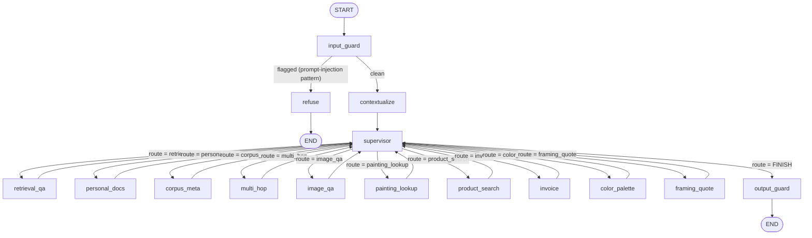

# agents/ — a multi-agent, MCP-grounded RAG system for a local art/painting corpus

This folder is the agent layer of a larger local-RAG project. It takes a
single-agent retrieval pipeline (built in an earlier phase, not included in
this folder — see **"Where this folder fits"** below) and wraps it in a
supervised, multi-specialist LangGraph agent with input/output guardrails,
a FastAPI chat backend, and a second MCP server that exposes the whole
thing as one tool.

This README replaces the old phase-by-phase development journal that used
to live here. That journal is preserved in full further down
(**"Appendix: development history"**) because it contains real, cited
before/after fixes from live runs that are still useful evidence of how
the routing and guardrail logic reached its current shape — but it is no
longer the right place to look if you just want to know what this system
does or how to run it.

---

## 1. What it does, and who it's for

**What it does:** answers natural-language questions about a fixed corpus
of art/painting documents (technique guides, artist references, etc.),
plus a handful of adjacent tasks that a plain retrieval-QA bot can't do on
its own:

- cite-backed Q&A over the corpus (`retrieval_qa`)
- multi-hop questions that need two different sub-topics combined (`multi_hop`)
- meta-questions about the corpus itself — "what documents do you have?" (`corpus_meta`)
- looking up a specific named painting, combining the corpus with a live web/Wikipedia lookup (`painting_lookup`)
- showing corpus images, or finding corpus images similar to one you upload (`image_qa`)
- answering questions about a file *you* uploaded into the conversation (`personal_docs`)
- searching the live web for real, purchasable art supplies (`product_search`)
- building an itemized invoice for supplies found earlier in the same chat (`invoice`)
- generating a color palette from a color name, hex code, or mood (`color_palette`)
- getting a framing/shipping cost estimate for a finished artwork (`framing_quote`)

A **supervisor** node routes each turn to the right specialist (or several,
in sequence, if the first attempt says it couldn't help), and two
**guardrail** nodes bracket the whole loop: one scans incoming messages for
prompt-injection patterns before the supervisor ever sees them, the other
scans every outgoing message for PII and disallowed links before the user
sees them.

**Who it's for:** this is a project built to demonstrate a specific set of
architectural disciplines — MCP as the *only* path from agent code to the
retrieval pipeline, validated (not just prompted) routing, structural
guardrails that don't depend on an LLM behaving, and honest before/after
documentation of real failures found in live runs. It's written for
someone extending or grading that project, or for a developer who wants a
worked example of a small, local-model-friendly multi-agent LangGraph
system with real guardrails. It is **not** a drop-in product — see
section 3.

---

## 2. Architecture

### 2.1 Process/consumer view

```
                 ┌─────────────────────────┐
                 │  Claude Code / Cursor /  │
                 │  OpenCode (dev tools)    │
                 └────────────┬─────────────┘
                              │ stdio, MCP
                              ▼
   ┌────────────────────────────────────────────────┐
   │           mcp_server/server.py   (Phase 1)       │
   │  raw tools: retrieve, generate_answer,           │
   │  retrieve_images, search_painting_online,        │
   │  search_art_supplies, generate_invoice,          │
   │  generate_color_palette, get_framing_quote, ...  │
   │  — talks to retrieval/, embeddings/, generation/  │
   └───────────────┬──────────────────────┬──────────┘
                    │ stdio (default)      │ HTTP (Docker/compose)
                    ▼                      ▼
   ┌───────────────────────────────────────────────────────────┐
   │                    agents/  (this folder)                  │
   │                                                             │
   │   agents/graph.py  — compiled LangGraph StateGraph           │
   │   agents/api.py    — FastAPI chat backend (this repo's       │
   │                       primary way to actually use the system)│
   │   agents/agent_mcp_server.py — a SECOND MCP server that       │
   │        exposes the whole graph as one tool, ask_multi_agent_rag│
   └───────────┬───────────────────────────────┬─────────────────┘
               │ stdio, MCP                    │ HTTP
               ▼                                ▼
   ┌───────────────────────┐        ┌───────────────────────────┐
   │ Claude Code / Cursor / │        │ browser at localhost:8001  │
   │ OpenCode, pointed at   │        │ (agents/static/chat.html,  │
   │ agent_mcp_server.py    │        │  served by api.py itself)  │
   │ instead of server.py   │        └───────────────────────────┘
   └───────────────────────┘
```

Two MCP servers exist on purpose and are never merged (see §5 for why):
`mcp_server/server.py` exposes *raw* retrieval/generation primitives with
no routing and no guardrails; `agents/agent_mcp_server.py` exposes one
tool that runs a question through the *entire* guarded, routed pipeline.

### 2.2 Graph view (what actually runs per turn)



Every specialist edges back to `supervisor`, never to `END` and never to
another specialist directly. The supervisor is the only node that can end
a turn and the only node with a cycle back into it — that's what makes the
iteration cap (`DEFAULT_ITERATION_CAP` in `supervisor.py`) a meaningful,
enforceable number: it counts visits to *this one node*. `input_guard`,
`refuse`, `contextualize`, and `output_guard` each run at most once per
turn, unconditionally, by construction of the edges above — none of them
count against the cap.

### 2.3 The ten specialists

| Specialist | Tools it's bound to | LLM calls | What it's for |
|---|---|---|---|
| `retrieval_qa` | `retrieve`, `generate_answer` | agentic loop (`create_react_agent`) | Cite-backed Q&A over the corpus |
| `personal_docs` | `retrieve` (scoped to this thread's uploads) | one (generate) | Answers about a file *you* uploaded this conversation |
| `corpus_meta` | none — static document list baked in at build time | one | "What documents are in your corpus?" |
| `multi_hop` | `retrieve`, `generate_answer` (fixed shape) | three (decompose, then synthesize) | Questions needing two sub-topics combined |
| `image_qa` | `retrieve_images` | **zero** | Shows corpus images, or finds similar ones to an upload |
| `painting_lookup` | `retrieve`, `search_painting_online` (fixed shape) | one (synthesize) | Named-painting lookup, corpus + web |
| `product_search` | `search_art_supplies` | one (comparison text only) | Real, purchasable art-supply search |
| `invoice` | `generate_invoice` | **zero** | Itemized invoice from earlier `product_search` results in this chat |
| `color_palette` | `generate_color_palette` | **zero** | Palette from a color, hex code, or mood |
| `framing_quote` | `get_framing_quote` | one (or asks for missing details) | Framing + shipping cost estimate |

Three specialists (`image_qa`, `invoice`, `color_palette`) make **zero**
LLM calls at all — every number or caption they show comes straight out of
a tool's own structured return value, so they cannot hallucinate a price,
a caption, or a hex code even in principle. `corpus_meta` makes one call
but is given no tools at all, so it cannot fabricate anything about
document *content* — only the corpus's own document list, fetched once and
baked into its system prompt. See §5 for why this "structural guardrail,
not a prompt instruction" pattern is used throughout instead of just
telling the model not to make things up.

---

## 3. Where this folder fits (read this before trying to run anything)

**This zip/folder is `agents/` only** — one subdirectory of a larger
project. On its own it is not runnable: several modules in this folder
import from sibling packages that live one level up, in the project root,
and are **not** part of this folder:

```
project_root/                      <- these siblings are NOT in this zip
├── config.py                      <- model names, API keys config, RAW_DOCS_DIR
├── personal_rag.py                <- the "temp" per-thread upload collection
├── usage_tracker.py                <- Groq rate-limit usage tracking
├── groq_client.py                  <- thin requests-based Groq HTTP client
├── together_client.py              <- thin requests-based Together AI HTTP client
├── local_rag/
│   ├── safety/
│   │   ├── prompt_injection.py     <- regex patterns agents/guardrails.py reuses
│   │   ├── pii_redaction.py        <- regex PII redaction agents/guardrails.py reuses
│   │   └── domain_allowlist.py     <- link-stripping allowlist
│   └── usage_tracker.py
├── retrieval/ embeddings/ generation/ ...  <- the underlying RAG pipeline
├── mcp_server/
│   └── server.py                   <- Phase 1: the ONLY thing agents/ is allowed
│                                       to talk to for retrieval/generation
└── agents/                         <- this folder
```

**If you have the full project**, drop this `agents/` folder in as a
sibling of `mcp_server/`, `local_rag/`, `config.py`, etc., exactly where it
already expects to be (`mcp_client.py` derives `mcp_server/server.py`'s
path from its own file location, i.e. `Path(__file__).parent.parent /
"mcp_server" / "server.py"` — the two folders must be direct children of
the same project root).

**If you only have this folder**, you cannot run the system end to end.
You *can* still read every file, run the `python -m agents.test_*_smoke`
suites that fake out the missing pieces (see §4.5), and use this README to
understand the design. Getting it fully running requires the rest of the
project. This is stated plainly here — see also **Known limitations**
(§6) — rather than glossed over, because a setup guide that pretends this
folder is self-contained would fail on the very first `import`.

---

## 4. Setup instructions

These assume you have (or are recreating) the full project layout from §3.
Every command below is run **from `project_root/`**, not from inside
`agents/`.

### 4.1 Prerequisites

- Python 3.12 (the example configs use `py -3.12` / a pinned interpreter path)
- [Ollama](https://ollama.com) running locally, with the models named in
  `config.py`'s `OLLAMA_GENERATION_MODELS` pulled (`ollama pull <model>`)
  — this is the always-available local fallback for every LLM call site
- The base RAG pipeline (`mcp_server/`, `retrieval/`, `local_rag/`, etc.)
  already set up and a corpus already ingested — the earlier phase this
  project builds on
- (Optional, recommended) a free **Groq** API key — the system's primary,
  fast LLM backend; everything still works with only Ollama, just slower
- (Optional) a **Together AI** API key — an extra hosted fallback layer
  used only for small/routing-tier calls; entirely optional, nothing
  breaks if unset

### 4.2 Install

```bash
# from project_root/
pip install -r agents/requirements.txt
pip install -r agents/requirements-api.txt   # only needed for the FastAPI chat server
```

`agents/requirements.txt` is explicitly **additive** to `mcp_server/`'s
own requirements and the project's own top-level `requirements.txt` —
install all of them, not just this one.

### 4.3 Configure environment variables

Create a `.env` (or export these directly) at `project_root/`:

| Variable | Required? | Purpose |
|---|---|---|
| `GROQ_API_KEY` | optional but recommended | Primary hosted LLM backend (`llm_provider.py`) |
| `TOGETHER_API_KEY` | optional | Extra hosted fallback for small/routing-tier calls only |
| `MCP_TRANSPORT` | optional (default `stdio`) | `stdio` (spawn `mcp_server/server.py` as a subprocess) or `http`/`streamable-http` (connect to an already-running server) |
| `MCP_SERVER_URL` | only if `MCP_TRANSPORT=http` | e.g. `http://127.0.0.1:8765` or a Docker Compose service name |
| `AGENT_API_DB_PATH` | optional (default `agents/chat_history.sqlite3`) | LangGraph SQLite checkpoint file, `api.py` only |
| `AGENT_API_ITERATION_CAP` | optional (default `supervisor.py`'s `DEFAULT_ITERATION_CAP`, currently `9`) | Per-turn supervisor visit cap |
| `AGENT_API_ROUTE_FORMAT` | optional (default `json_schema`) | `json_schema` or `json` — see the routing note in §5 |
| `AGENT_API_HOST` / `AGENT_API_PORT` | optional (default `127.0.0.1` / `8001`) | Only used by `python -m agents.api` |
| `AGENT_API_TURN_TIMEOUT_SECONDS` | optional (default `1200`) | Per-turn server-side timeout |
| `AGENT_API_RATE_LIMIT` | optional (default `120/minute`) | Server-side rate limit |

With no keys set at all, every LLM call site degrades straight to local
Ollama — the system still runs, just without the Groq/Together speed-up.

### 4.4 Run it — three ways

**A. One-off question from the command line** (no persistent history,
rebuilds the graph fresh each call):

```bash
python -m agents.graph "What is glazing in oil painting?"
```

Optional second arg selects the routing-decoding mode
(`json_schema` default, or `json`); optional third arg forces one
specific specialist, bypassing the supervisor:

```bash
python -m agents.graph "What does this brush look like?" json_schema image_qa
```

**B. The chat API + built-in browser UI** (persistent, multi-turn,
survives restarts — the intended way to actually use this system):

```bash
python -m agents.api
# or: uvicorn agents.api:app --reload --port 8001
```

Then open `http://localhost:8001/` in a browser. Conversation history is
stored in a local SQLite file (`AGENT_API_DB_PATH`). Endpoints include
`POST /chat`, `POST /chat/{id}/retry`, `POST /chat/{id}/edit`,
`GET /chat/{id}/history`, `GET /chats`, `GET /tools`,
`POST /chat/{id}/upload` (feeds `personal_docs`), `POST /chat/{id}/branch`,
`DELETE /chat/{id}`, `GET /v1/usage`, and `GET /health`.

**C. As an MCP tool inside Claude Code / Cursor / OpenCode:**

```json
{
  "mcpServers": {
    "multi-agent-rag": {
      "command": "/absolute/path/to/python",
      "args": ["/absolute/path/to/project_root/agents/agent_mcp_server.py"]
    }
  }
}
```

(`agents/mcp_config.example.json` and `agents/opencode.example.json` are
ready-to-edit copies of this, including the raw `mcp_server/server.py`
registered alongside it under a second name, `local-rag`, if you want to
compare guarded/routed answers against raw retrieval from the same
client.) This exposes one tool, `ask_multi_agent_rag`, that runs a
question through the entire guarded, routed pipeline and returns
`{answer, blocked, specialists_visited, iteration_count}`.

### 4.5 Verify it worked

```bash
python -m agents.test_graph_smoke          # compiles + runs the real StateGraph, faked LLM/specialists
python -m agents.test_supervisor_smoke      # routing validation logic
python -m agents.test_guardrails_smoke      # input/output guard behavior
python -m agents.test_api_smoke             # FastAPI app over HTTP, faked backend
```

These four run **without** Ollama, Groq, or a real corpus — they fake the
model and the MCP client. If they pass but `python -m agents.graph "..."`
fails, the problem is in your environment (Ollama not running, corpus not
ingested, `mcp_server/server.py` not found, missing API keys), not in this
code.

---

## 5. Technical decisions and justifications

**MCP as the only path from agent code to retrieval.** No specialist
imports `retrieval/`, `generation/`, `embeddings/`, etc. directly — every
one talks to `mcp_server/server.py` exclusively via
`langchain-mcp-adapters`. This is what makes it possible to say
Claude Code/Cursor/OpenCode and this agent graph are provably hitting the
same retrieval code path, not two implementations that can silently
drift apart.

**Two MCP servers, kept separate rather than merged.**
`mcp_server/server.py` exposes raw primitives (no routing, no guardrails);
`agent_mcp_server.py` exposes one guarded, routed tool. Folding the second
into the first would mean one server spawning a subprocess of itself to
answer its own tool call, and would blur what the raw server's screenshots
are meant to prove (raw retrieval, not the guarded agent).

**Three genuinely different specialist shapes, not seven-to-ten copies of
the same agent.** `retrieval_qa` is a real `create_react_agent` because
deciding whether one `retrieve()` call was enough is exactly the kind of
judgment call that shouldn't be hardcoded. `multi_hop` and
`painting_lookup` are explicit, fixed-shape Python instead, because their
iteration count needs to be knowable in advance once the supervisor is
counting visits against a shared cap — an agentic loop inside a specialist
would make that count unpredictable in exactly the place it most needs to
be fixed. `image_qa`, `invoice`, and `color_palette` use **zero** LLM
calls, because every value they display is already structured data
returned by a tool — there is nothing for a model to paraphrase or
hallucinate if it's never asked to.

**Validated routing — three independent checks, not one prompt
instruction.** The supervisor's LLM is constrained to a Pydantic
`RouteDecision` with a `Literal[...]` route field. (1) Schema validation
rejects a hallucinated name outright. (2) A separate membership check
against the *actual* specialists dict the graph was built with catches the
case where the Literal has drifted out of sync with what's really
registered. (3) A repeat-route guard rejects even a schema-valid, known
route if that specialist has already answered this turn — added after a
confirmed live run showed a local model validly, repeatedly choosing the
same specialist despite an explicit prompt instruction not to. Each check
exists because an earlier live run found the previous checks
insufficient — see the appendix for the specific failures.

**Structural guardrails over prompt-only guardrails, applied
consistently.** `corpus_meta`'s zero-tool design, `retrieval_qa`'s direct
extraction of the tool's own cited output instead of trusting the model's
final paraphrase, and the two Phase 4 guard nodes (`input_guard`,
`output_guard`) — none of these call an LLM. They reuse the base
pipeline's own `local_rag/safety/` regex modules and plain Python, on the
theory that a check a model can silently ignore isn't a check.

**Groq → Together → local Ollama, chosen per call, inside one
`BaseChatModel`.** `llm_provider.py`'s `GroqFallbackChatModel` tries Groq
first for every reasoning call site, adds one more hosted hop (Together)
for small/routing-tier calls specifically (because supervisor + specialist
routing calls share one low Groq token-per-minute ceiling and can exhaust
it within seconds of each other in a single turn), and falls back to local
Ollama on failure either way. Doing the fallback *inside* one chat-model
class — rather than picking a backend once at startup — makes degradation
genuinely per-call: Groq going down mid-conversation degrades that one
turn without any caller needing to know which backend actually answered.

**stdio by default, HTTP as an explicit opt-in.** `mcp_client.py` spawns
`mcp_server/server.py` as a local subprocess by default (works with zero
extra configuration for a single-machine dev setup) and switches to
connecting over HTTP to an already-running server only when
`MCP_TRANSPORT=http` is set explicitly — the shape a split-container
Docker Compose deployment needs, where the backend never needs
`mcp_server/`'s own source on disk at all.

**A real LangGraph checkpointer (SQLite) for the chat API, not
`ask()`'s rebuild-everything-per-call.** `agents/graph.py`'s `ask()`
builds a brand-new graph (new MCP client, new spawned subprocess, empty
message history) on every call — fine for the CLI and eval scripts, where
each question is independent, but wrong for a chatbot: every turn would
pay subprocess-startup latency and start with amnesia, silently breaking
`invoice` (which specifically reads prior `product_search` messages back
out of conversation state). `agents/api.py` instead compiles **one** graph
once, with `AsyncSqliteSaver`, and threads calls through it by
`thread_id`.

**Iteration cap sized mechanically from the route count, not
guessed.** `DEFAULT_ITERATION_CAP` (currently `9`, for ten specialists) is
derived from the repeat-route guard's own worst case: walking every
untried specialist once before force-`FINISH`ing, plus one buffer call to
land on `FINISH` normally. It is a mechanical consequence of how many
routes exist, not an independently-tuned constant — raising it when a
specialist is added is a formula, not a guess.

---

## 6. Known limitations

Being direct about these rather than hiding them:

- **This folder is not self-contained.** As stated in §3, several modules
  import from sibling packages (`config.py`, `personal_rag.py`,
  `usage_tracker.py`, `groq_client.py`, `together_client.py`,
  `local_rag/safety/`) that are not part of this zip. A README that hid
  this would let someone burn time on a confusing `ModuleNotFoundError`
  instead of understanding the real prerequisite up front.

- **This README itself had drifted from the code before this rewrite,
  and may drift again.** The previous version of this file documented
  only 7 of the 10 specialists that actually exist in `specialists.py`
  today (`personal_docs`, `color_palette`, and `framing_quote` were added
  without a corresponding README update), and `API_README.md` documents
  only 4 of `api.py`'s 12 actual endpoints (`retry`, `edit`,
  `list_chats`, `list_tools`, `upload`, `branch`, `usage`, and
  `get_image` are all real, working endpoints with no write-up). This
  rewrite reflects the code as read directly from source rather than
  trusting the old docs, but the same drift can recur if new code is
  added without updating this file.

- **Guardrails are regex-based, not semantic.** `scan_for_injection`'s
  patterns and `redact_pii`'s structured-PII matching are the same fixed
  pattern lists the base pipeline already documents as catching "the
  common, unsophisticated patterns" — explicitly not a complete defense.
  A rephrased or obfuscated injection attempt can slip past `input_guard`;
  unstructured PII written in free prose (a name or address, not an
  email/phone/SSN/card-shaped string) will not be caught by
  `output_guard`.

- **Local small-model routing is genuinely unreliable, which is why three
  separate safety nets exist around it rather than one.** Live runs
  showed a local model repeatedly choosing the same route regardless of a
  changing transcript, and (separately) a Groq-rate-limited turn falling
  back to a local small model that repeated the same route on every
  visit. The repeat-route guard and the separate, much lower
  distinct-specialist cap both exist specifically to bound the damage
  from this rather than assuming it won't happen.

- **`corpus_meta`'s document list is a one-time snapshot**, taken when
  `build_specialists()` runs. It goes stale if you re-ingest the corpus
  without restarting the graph process — the same staleness tradeoff the
  base retrieval pipeline's BM25 index already has.

- **`product_search`'s "beginner vs. professional" tier classification is
  a keyword heuristic with a price-relative-to-median tiebreak**, not a
  real product-attribute lookup. A free/keyless search snippet can't
  reliably promise more than that.

- **The chat API's persistence is a single local SQLite file** — fine for
  one person's local use, not multi-process-safe, and there is no
  authentication in front of it.

- **No streaming.** `POST /chat` blocks until the supervisor loop reaches
  `FINISH` or the iteration cap forces a partial answer.

- **`agent_mcp_server.py` rebuilds the whole graph (and re-spawns
  `mcp_server/server.py`, re-warming its embedder) on every single tool
  call** — no caching, no persistent connection reuse. Real latency per
  call, in exchange for zero new state-management code beyond what
  `agents.graph` already has test coverage for. A module-level compiled
  graph built once at server startup is the natural next step if that
  latency matters.

- **`create_react_agent` (used for `retrieval_qa`) is deprecated** as of
  LangGraph 1.0 in favor of `langchain.agents.create_agent`, though it
  still works through at least LangGraph 1.2.x.

- **Most specialists only ever read the latest message as their
  question**, not the full conversation. `invoice` is a deliberate
  exception (it scans the whole thread for prior `product_search`
  results); giving every specialist real cross-turn context (resolving
  "that painting I asked about earlier") would require changing how each
  one builds its question — not done here.

---

## Appendix: development history

The remainder of this document is the original, phase-by-phase README,
preserved below as a record of the confirmed live-run failures and fixes
that shaped the routing/guardrail logic described in §5. It predates the
four extra specialists documented above and is not kept up to date —
treat it as historical evidence, not as current setup instructions.

---

# agents — Phase 2 & Phase 3

Three specialists, each a LangGraph node, each talking to the retrieval
pipeline exclusively through the Phase 1 MCP server (`mcp_server/server.py`)
via `langchain-mcp-adapters` — never by importing `retrieval/`,
`generation/`, etc. directly. That's the point of doing Phase 1 first:
Claude Code/Cursor/OpenCode and this agent graph are now provably hitting
the same code path.

## Layout

```
project_root/
├── config.py                  # yours, from earlier sessions
├── retrieval/ embeddings/ ...  # yours, from earlier sessions
├── mcp_server/                 # Phase 1
│   └── server.py
└── agents/                     # Phase 2 + Phase 3 (this folder)
    ├── state.py                # shared AgentState schema
    ├── prompts.py               # narrow system prompts, one per specialist + the supervisor
    ├── mcp_client.py            # shared MCP-client plumbing
    ├── specialists.py           # the three specialist node functions (Phase 2)
    ├── supervisor.py            # validated-routing supervisor node (Phase 3)
    └── graph.py                 # wires supervisor + specialists into one compiled graph (Phase 3)
```

## The three specialists

| Specialist | Tools bound | How it decides when to stop |
|---|---|---|
| `retrieval_qa` | `retrieve`, `generate_answer` | `create_react_agent` — the LLM loops for itself |
| `corpus_meta` | *none* | one plain LLM call over a baked-in document list |
| `multi_hop` | `retrieve`, `generate_answer`, called directly | fixed shape: decompose → retrieve ×2 → synthesize |

Three genuinely different tool footprints, not three copies of the same
agent with different prompts:

- **`retrieval_qa`** is a real `create_react_agent`, because letting the
  LLM decide whether one `retrieve()` call was enough (or whether it
  needs to try again with a reformulated query) is exactly the kind of
  judgment call a fixed script shouldn't be making instead of the model.
- **`corpus_meta`** is deliberately given zero tools. The document list
  is fetched once, at `build_specialists()` time, and baked into its
  system prompt as static text — it cannot fabricate an answer about
  document *content*, because it has never been given any content. This
  is the structural guardrail the Sub-Project 2 spec asks for in a
  corpus-meta specialist, not just a prompt instruction hoping the model
  behaves.
- **`multi_hop`** is *not* a `create_react_agent`. Its three model calls
  (decompose, then — after two explicit `retrieve()` calls — synthesize)
  are plain Python, so the iteration count for this node is always
  knowable in advance. That matters once Phase 3's supervisor is
  counting iterations against the graph-wide cap: an agentic loop here
  would make that count unpredictable in exactly the node where you most
  want it fixed.

## Four more specialists (added on top of Phase 2/3)

Four more specialists sit on top of the original three, added to support
image display, named-painting lookup, art-supply shopping, and invoicing.
Same architecture rules apply to all four: every one talks to the
pipeline exclusively through the MCP server (`mcp_server/server.py`'s
new `retrieve_images`, `search_painting_online`, `search_art_supplies`,
and `generate_invoice` tools — see `mcp_server/README.md`), and each is
built for the specific kind of question it handles rather than being a
generic fourth copy of `retrieval_qa`.

| Specialist | Tools bound | LLM calls | How it decides when to stop |
|---|---|---|---|
| `image_qa` | `retrieve_images` | **zero** | one tool call, deterministic markdown+caption formatting |
| `painting_lookup` | `retrieve`, `search_painting_online` | one (synthesis) | fixed shape: retrieve (corpus) + search (web), always exactly once each, then synthesize |
| `product_search` | `search_art_supplies` | one (comparison paragraph only) | one tool call, Python picks the top 5, LLM only narrates around them |
| `invoice` | `generate_invoice` | **zero** | scans the *whole* conversation history (not just this turn) for prior `product_search` results, Python does the arithmetic |

- **`image_qa`** is the most structurally-guardrailed of the seven:
  zero LLM calls at all. `retrieve_images()` already returns a caption
  per image (see `mcp_server/image_tools.py`), so this node's only job
  is deterministic markdown formatting of the tool's own output — the
  same "structurally cannot hallucinate" property `corpus_meta` gets
  from having no tools, applied here to having no LLM.
- **`painting_lookup`** is *not* a `create_react_agent`, for the same
  reason `multi_hop` isn't one: its two source calls (one `retrieve()`
  against the corpus, one `search_painting_online()` against the
  internet) always happen exactly once each in explicit Python, so its
  iteration count is fixed and knowable in advance. Its one LLM call
  combines both sources into a single answer; the source links
  themselves are appended afterward, deterministically, never written
  out by the model.
- **`product_search`** picks its top 5 candidates in Python (price
  presence first, preserving the search backend's own relative ranking
  within each group) and only ever asks the LLM to write a short
  comparison paragraph around them — `PRODUCT_SEARCH_SYSTEM_PROMPT` is
  explicit that it must never invent a price or a link, and the actual
  rendered price/link for each pick comes straight from the tool's own
  data, not from the model's text. It also embeds a hidden, machine-
  parseable `<!--PRODUCT_DATA:[...]-->` footer in its own message (an
  HTML comment, invisible in any markdown client) — this is how
  `invoice_node` later reconstructs exactly which products were shown,
  without ever needing an LLM to re-read and re-parse its own past
  prose.
- **`invoice`** is the second fully zero-LLM specialist. Every number on
  the invoice is computed in plain Python (`mcp_server/invoice_tools.py`)
  from the structured data parsed out of prior `product_search`
  messages — see `agents/specialists.py`'s `_collect_product_catalog` /
  `_select_invoice_items` for the matching heuristic (explicit "all of
  them" phrasing, then a name-word match, then a fallback to the most
  recent search's items with an explicit assumption note surfaced to the
  user). This is deliberately the ONE specialist that reads the entire
  conversation history rather than only the current turn — see that
  function's own docstring for why.

## Routing rules for the new specialists (what the supervisor is told)

`SUPERVISOR_SYSTEM_PROMPT` (in `prompts.py`) spells these out literally,
because testing surfaced real misroutes without them:

- A question naming one **specific famous painting by title** →
  `painting_lookup`, not `retrieval_qa` (it checks the corpus itself as
  one of its two sources, so nothing is lost).
- A question about **buying, pricing, or comparing physical art
  supplies/tools** → `product_search`, **always** — the corpus has zero
  product data, so `retrieval_qa`/`corpus_meta` can never legitimately
  answer this, even when the question is phrased like a technique
  question ("what's a good brush for glazing" is a product question;
  "how do I glaze" is not).
- A request to **see/view** something → `image_qa`; a request to have
  something **explained in words** → `retrieval_qa`/`painting_lookup`.
- A request for a **total price, invoice, or receipt** for
  already-discussed products → `invoice`.

## Iteration cap: raised from 4 to 8

`DEFAULT_ITERATION_CAP` moved from 4 (three specialists) to 8 (seven).
Same formula as before, just against a bigger `known_routes` set: the
repeat-route guard's worst case is walking every untried specialist once
before forcing `FINISH`, so the cap has to be large enough to let that
fallback actually reach all seven, plus one buffer call to land on
`FINISH` normally. See `supervisor.py`'s own comment on
`DEFAULT_ITERATION_CAP` for the full reasoning — this is a mechanical
consequence of adding more routes, not a new judgment call.

## Guardrail improvements

Extended `agents/guardrails.py` and `local_rag/safety/prompt_injection.py`
alongside these four specialists, since they add a genuine
money-handling code path (`invoice`) and a genuine link-surfacing one
(`painting_lookup`, `product_search`) that didn't exist before:

- **New injection patterns** aimed at price/total manipulation ("set the
  price to...", "override the total...") and tool-call-forcing phrasing
  ("call the X tool with...", "fetch url: http://...").
- **`input_guard` now also flags excessive input length** (over ~6000
  characters), a signal independent of pattern matching — a
  context-stuffing attack doesn't need to contain any known phrase to be
  worth catching.
- **`output_guard` now also strips any markdown link whose domain isn't
  on `local_rag/safety/domain_allowlist.py`'s allowlist**, replacing it
  with plain label text rather than deleting the sentence around it.
  This is a *sink*-side check: `mcp_server/web_tools.py` and
  `invoice_tools.py` already filter links at the *source* (a tool call
  itself never returns an unlisted domain) — this only fires if a model
  paraphrases or reconstructs a URL on its own, which source-side
  filtering alone can't catch. See `domain_allowlist.py`'s own module
  docstring for the full "why both checks" reasoning.

New tests: `agents/test_new_specialists_smoke.py` (all four new
specialists, node-level, no live Ollama/MCP server) and
`agents/test_guardrails_extensions_smoke.py` (the new patterns, the
length guard, and link stripping — each with a passing AND a
should-not-fire case). `mcp_server/test_new_tools_smoke.py` covers the
tool-side logic (price extraction, allowlist filtering, invoice
arithmetic) independently, with network calls faked.

```bash
python -m agents.test_new_specialists_smoke
python -m agents.test_guardrails_extensions_smoke
python -m mcp_server.test_new_tools_smoke
```

## Confirmed live-run fixes (second pass, after real end-to-end runs)

Running `python -m agents.graph` live (with a real Ollama model and a
real ingested corpus) against the four new specialists surfaced four
real problems the offline smoke tests couldn't catch on their own —
each fixed below, in the same "confirmed failure, not a hypothetical
one" spirit `supervisor.py`'s own docstring already uses for the
original three specialists' fixes.

### 1. The repeat-route guard's worst case surfaced the WRONG answer

**Confirmed live-run failure**: with seven specialists now routable, a
live run of `python -m agents.graph "Tell me about the Mona Lisa"`
showed the supervisor's raw model output stuck on
`{"route": "painting_lookup"}` on every single visit — the "same route
regardless of a changing transcript" symptom `DEFAULT_ROUTE_FORMAT`'s
docstring already documents for `llama3.2`, now confirmed to generalize
beyond `retrieval_qa`. The repeat-route guard did exactly its job and
walked every other untried specialist in order before force-FINISHing —
but both `agent_mcp_server.py`'s `_summarize()` and `eval_phase5.py`'s
`_extract_route_info()` pick "the last specialist message" as *the*
answer (deliberately — see their own docstrings on skipping a trailing
`supervisor` meta-note), and whichever specialist the guard happened to
land on last was very often one of the "usually has nothing to say
without real underlying data" specialists (`invoice` with no prior
product search, `product_search` if the search backend is unavailable)
— a wrong, unrelated refusal shown as the answer to a question that had
already been answered correctly on the very first routing decision.

**The fix**: `supervisor.py`'s `_finalize_with_first_attempt` reaffirms
the FIRST specialist to answer this turn as the final message — under
that specialist's own name, with its full original content — instead of
leaving a bare `supervisor` meta-note (or nothing at all) as the
transcript's last specialist-named message. Because it carries the
first specialist's real name, both consumers' existing "last specialist
message" extraction logic picks it up correctly with **zero changes
needed on their end** — the fix lives entirely in the data shape
`supervisor.py` produces, the same "structural guardrail" preference
this project applies everywhere else. See that function's own docstring
for the honest, stated tradeoff this doesn't handle (it always trusts
the FIRST attempt, even in a hypothetical case where a later re-route
was genuinely well-reasoned rather than a repeat-route override).

### 2. Specialist build order reordered as a second, independent mitigation

`build_specialists()`'s returned dict order changed from
`retrieval_qa, corpus_meta, multi_hop, image_qa, painting_lookup,
product_search, invoice` to `retrieval_qa, corpus_meta, product_search,
invoice, multi_hop, image_qa, painting_lookup` — moving the two
specialists most likely to have nothing to say without prior context
(`product_search`, `invoice`) earlier, so a full repeat-route-guard walk
is less likely to burn its LAST slot on one of them in the first place.
This doesn't replace fix #1 above (which fixes *which* answer gets
surfaced regardless of walk order) — it's a second, independent
mitigation for the same underlying failure, worth keeping even though
fix #1 already makes the walk order's consequence much smaller.

### 3. `painting_lookup` resolved to the wrong Wikipedia page

**Confirmed live-run failure**: the same Mona Lisa run's sources line
showed `[Wikipedia: Mona Lisa Smile]` — the 2003 film, not the painting.
`painting_lookup_node` passes the user's full, unedited question into
`search_painting_online`; Wikipedia's search-API fallback (used when the
exact-title lookup 404s) matched the whole sentence, question-wrapper
words and all, more strongly against the film's page than the
painting's.

**The fix**: `mcp_server/web_tools.py`'s `search_famous_painting` now
strips a fixed set of common question-phrasing prefixes ("tell me
about", "who painted", "what is", etc.) via `_clean_painting_query`
before EITHER Wikipedia lookup or the supplementary web search — fixed
at the tool level, not the specialist call site, so it protects every
current and future caller of `search_painting_online`, not just
`painting_lookup_node`. The corpus `retrieve()` call still gets the full
original question (hybrid/BM25 retrieval benefits from the extra context
words rather than being confused by them). See
`test_new_tools_smoke.py`'s two new tests for the cleaning regex itself
and for confirmation the cleaned query is what actually reaches every
lookup call.

### 4. `product_search` now returns two tiers: beginner-friendly and professional-grade

Per an explicit design request: `product_search_node` now fetches a
bigger raw candidate pool (`max_results=12`, up from 8) and splits it
into "beginner-friendly" and "professional-grade" buckets — up to 5 of
each, rendered as two clearly labeled sections, backed by two
independent structured-data groups in the hidden `PRODUCT_DATA` footer
(each item now also carries a `"tier"` key).

Classification (`specialists._classify_tier`) is a keyword heuristic
over each candidate's title/snippet — "professional", "kolinsky",
"studio", "conservation", etc. vs. "student", "starter", "budget",
"kids", etc. — with a price-relative-to-the-pool's-median tiebreak for
anything matching neither list (at/below median → beginner, above →
professional; no price and no keyword → beginner, a stated default, not
a silent guess). This is explicitly a heuristic, not a real
product-attribute lookup — see `_classify_tier`'s own docstring for why
a free/keyless search snippet can't reliably promise more than that,
the same honest-limitation pattern `search_art_supplies`' own price
extraction already states.

The LLM's one call is now two short, tier-scoped paragraphs
(`PRODUCT_SEARCH_SYSTEM_PROMPT` is explicit it must never compare across
tiers or invent a candidate to fill an empty one) — every price/link
rendered is still taken directly from the tool's own data, never from
the model's text, the same guarantee the original single-tier design
already had.

New tests (`agents/test_new_specialists_smoke.py`): keyword
classification in isolation, a 7-beginner/3-professional pool confirming
the 5-per-tier cap actually caps (not just happens to have ≤5 results),
the price-median tiebreak for keyword-less items, and an empty-tier case
confirming a missing tier is reported plainly rather than padded.

```bash
python -m agents.test_new_specialists_smoke   # covers all four fixes above
python -m agents.test_graph_smoke              # updated for fix #1's new message shape
python -m agents.test_guardrails_smoke         # updated for fix #1's new message shape
python -m mcp_server.test_new_tools_smoke      # covers fix #3's query-cleaning mechanism
```

## Building and calling them

```python
from agents.specialists import build_specialists
from langchain_core.messages import HumanMessage

specialists = await build_specialists()  # one shared MCP client + corpus snapshot

state = {"messages": [HumanMessage(content="What is glazing?")], "route": None, "iteration_count": 0}
result = await specialists["retrieval_qa"](state)
print(result["messages"][-1].content)
```

`build_specialists()` is async and does real I/O (spawns the MCP server
subprocess, fetches the corpus resource) — call it once per graph run,
not once per specialist call. The dict keys (`retrieval_qa`, `corpus_meta`,
`multi_hop`) are the same route names Phase 3's supervisor will use as its
`Literal[...]` type and its known-agent allowlist, so keeping this dict's
keys as the single source of truth is what makes the supervisor's
validated-routing check a simple membership test.

## Testing — two levels, run both

**`test_specialists_smoke.py`** — fake MCP client, fake corpus, a scripted
fake chat model, real `specialists.py` control flow. No Ollama, no
ingested corpus needed; runs anywhere in seconds. Catches wiring bugs
(wrong dict key, wrong message type, wrong tool-result unwrapping) before
they cost you a real model call to discover. Covers all three specialists,
including the `multi_hop` decomposition-JSON-parse-failure fallback path.

```bash
python test_specialists_smoke.py
```

**`test_specialists_live.py`** — real MCP server, real Ollama, real
ingested corpus. This is the one that actually tells you whether the
specialists are ready for Phase 3: does `retrieval_qa` cite a real
filename from your corpus? Does `corpus_meta`'s document list match your
last real ingestion run? Does `multi_hop` actually draw on two distinct
sub-topics? Adjust the three `QUESTION_*` constants at the top of the file
to match content you know is actually in your corpus before trusting the
output.

```bash
python test_specialists_live.py
```

## Phase 3 — supervisor and the compiled graph

`supervisor.py` builds the one node that decides, on every visit, which
specialist handles the current question next, or whether the turn is
done. The supervisor never calls `retrieve`/`generate_answer` and never
produces the user-facing answer — it only ever emits a routing decision
(`{"route": "..."}`), which is what "the supervisor must never do the
work itself" means structurally here, not just as a prompt instruction.

`graph.py` wires it together with the three Phase 2 specialists into one
compiled `StateGraph`:

```
START -> supervisor --route=="retrieval_qa"--> retrieval_qa -+
            |         --route=="corpus_meta"--> corpus_meta -+--> back to supervisor
            |         --route=="multi_hop"---> multi_hop  --+
            +---------route=="FINISH"---------------------------> END
```

Every specialist edges straight back to `supervisor`, never to `END`
directly — the supervisor is the only node that can end the turn, and the
only node with a cycle back into it. That's what makes the iteration cap
meaningful: it counts visits to this one node, not some looser notion of
"graph steps."

### Validated routing (three independent checks, not one)

The supervisor's LLM is prompted for nothing but a bare JSON object
matching `RouteDecision`, a Pydantic model whose `route` field is a
`Literal["retrieval_qa", "corpus_meta", "multi_hop", "FINISH"]`. Three
checks sit between "the model said something" and "the graph routes
there":

1. **Schema-level** — `RouteDecision.model_validate_json(...)`. A
   hallucinated name outside the Literal fails Pydantic validation
   before it's inspected further. Malformed JSON (or no JSON at all)
   fails the same way.
2. **Explicit membership check** — the validated value is *also* checked
   against `known_routes`, built at graph-construction time from the
   actual specialists dict the supervisor was handed (`build_specialists()`'s
   own keys — the same single source of truth Phase 2's README already
   points at). This is deliberately redundant with (1) in the common
   case; it exists for the case the Literal alone can't catch — a
   specialists dict that's drifted out of sync with the hardcoded Literal
   (a specialist renamed or removed without updating `supervisor.py`).
   `test_supervisor_smoke.py`'s "membership check catches specialists
   dict drift" test constructs exactly that scenario: a schema-valid
   route name (`"multi_hop"`) that the *live* specialists dict doesn't
   actually contain, and confirms the membership check — not the schema —
   is what catches it.
3. **Repeat-route guard** — even a schema-valid, known route is rejected
   if it names a specialist that has *already answered this turn*. Added
   after a confirmed live-run failure (see "Known limitations" below):
   the first two checks can't catch a model validly, repeatedly choosing
   the same already-tried specialist, since the route is schema-valid
   and genuinely known both times — only tracking what's already been
   tried this turn catches it.

Any of the three failing routes to the next specialist that hasn't been
tried yet this turn (deterministic order — the order `specialists` was
built in), falling back to `DEFAULT_FALLBACK_ROUTE` (`"retrieval_qa"`)
only in the edge case where that's somehow not itself already tried, or
forcing `FINISH` with an explanatory note once every specialist has been.
None of these paths ever raises, and none of them ever falls back to
`"FINISH"` before at least one specialist has had a chance to answer —
a forced finish with nothing tried yet would silently return a
non-answer, while retrieval_qa (the first fallback candidate in practice)
is grounded by construction: it must retrieve before it can answer, and
says so plainly when retrieval comes up empty.

### Iteration cap: 4, and why

One supervisor visit = one routing decision (an initial pick, a
re-route, or a `FINISH`). The cap is checked at the top of every
supervisor visit, before any LLM call for that visit is made — once
exceeded, the supervisor forces `route = "FINISH"` and appends its own
`AIMessage(name="supervisor")` explaining plainly that the answer may be
partial, using whichever specialist's answer (if any) is already in
state. No LLM call is spent on a visit past the cap.

**Chosen at 4**: one initial pick, up to two re-routes if a specialist's
answer explicitly admits it couldn't help, and one buffer call to land on
`FINISH` — covers every Phase 5 eval case (including the adversarial
"make the supervisor route somewhere invalid" case, which burns a
decision on a fallback rather than a real route) without leaving so much
slack that a stuck loop wastes many model calls before the cap catches
it. If the real eval table regularly needs a 5th iteration, that's
evidence the specialists need work, not that this number is wrong — say
so in the report rather than quietly raising the constant.

### Testing — three files, same two-level philosophy as Phase 2

- **`test_supervisor_smoke.py`** — fake `ChatOllama`, real `RouteDecision`
  validation, real membership-check logic, real repeat-route-guard logic,
  real iteration-cap arithmetic. Covers: a normal first-call routing
  decision, a `FINISH` decision once a specialist has answered, a
  malformed-JSON fallback, a schema-rejected hallucinated route, the
  specialists-dict-drift case described above, both iteration-cap shapes
  (cap hit with vs. without a prior specialist answer already in state),
  the repeat-route guard redirecting a repeated decision to an untried
  specialist, the guard forcing `FINISH` once every specialist has been
  tried, a sanity check that a genuine `FINISH` decision is never
  mistaken for a repeat, and (at the message-list level) that the
  transcript actually travels in the human turn while the system prompt
  stays byte-identical across calls — the direct regression test for the
  third confirmed live-run fix described below.
- **`test_graph_smoke.py`** — the one test that actually compiles and
  runs the real `StateGraph` from `graph.py` (fake specialists, fake
  supervisor LLM, real LangGraph execution). Confirms the happy path
  (route → specialist → `FINISH`) end to end, and confirms a
  pathologically indecisive fake supervisor (one that always tries to
  re-route, never `FINISH`es) still terminates gracefully via the
  iteration cap rather than hanging or tripping LangGraph's unrelated
  `recursion_limit` error.
- **Live**: once you've verified Phase 2's specialists against your real
  corpus (see `test_specialists_live.py` above), run
  `python -m agents.graph "some real question"` against your real MCP
  server + Ollama to see an actual routed answer end to end — this is
  also the quickest way to eyeball whether `DEFAULT_ITERATION_CAP` and
  the supervisor's routing prompt need tuning before Phase 5's eval.

```bash
python -m agents.test_supervisor_smoke
python -m agents.test_graph_smoke
python -m agents.graph "What is glazing in oil painting?"   # live, needs Ollama + a real corpus
```

## Known limitations worth stating in the report

- **Confirmed failure + fix, worth citing as a Phase 5 iteration**:
  `retrieval_qa`'s live test answer initially had zero source citations,
  despite `RETRIEVAL_QA_SYSTEM_PROMPT` requiring them. Root cause: the
  ReAct loop's final turn re-narrates `generate_answer`'s already-cited
  output in the model's own words, dropping citations in the process.
  **First attempted fix was a prompt change** (an explicit "return that
  answer unchanged" instruction) — re-tested live, and it did *not* help;
  llama3.2 still paraphrased. That upgraded this from a suspected prompt
  failure to a confirmed **design failure**: no wording was going to fix
  it, because the citations were never at risk in the tool call itself,
  only in letting the model speak again afterward. The actual fix is in
  `specialists.py`: `retrieval_qa_node` now extracts `generate_answer`'s
  `ToolMessage` directly out of the agent's message history
  (`_extract_grounded_answer`) instead of trusting the final `AIMessage`.
  Good material for Phase 5's "what you changed" section — it's a clean
  two-iteration story (prompt fix tried and measured, then a design fix)
  with a concrete before/after.
- `corpus_meta`'s document list is a one-time snapshot taken when
  `build_specialists()` runs, same staleness tradeoff `retrieve()`'s BM25
  index already has (documented in `mcp_server/README.md`). Restart the
  graph process after re-ingesting if you want either to see new
  documents.
- `multi_hop`'s decomposition step assumes the underlying model reliably
  returns bare JSON when instructed to. `MULTI_HOP_DECOMPOSE_SYSTEM_PROMPT`
  asks for exactly that, and the fallback path in `specialists.py` handles
  it not doing so, but if you see the fallback firing often in your Phase
  5 eval, that's a real, worth-reporting model-following-instructions
  failure — not a bug to silently paper over.
- `create_react_agent` (used for `retrieval_qa`) is deprecated as of
  LangGraph 1.0 in favor of `langchain.agents.create_agent`, but still
  works through at least 1.2.x — see `requirements.txt`'s note.
- **Confirmed failure + fix, worth citing as a second Phase 5 iteration**
  (same two-step shape as `retrieval_qa`'s citation-dropping fix above —
  prompt fix tried first, found insufficient, then a code-level fix):
  a live run of `python -m agents.graph "What is glazing in oil
  painting?"` showed the supervisor routing to `retrieval_qa` four times
  in a row and exhausting `DEFAULT_ITERATION_CAP` (4) without ever
  saying `FINISH`, despite `SUPERVISOR_SYSTEM_PROMPT` explicitly
  instructing it not to re-route to an already-answered specialist. The
  stderr log confirmed this wasn't the schema/membership fallback firing
  (no "invalid or unrecognized" line before the cap message) — llama3.2
  was validly, repeatedly choosing the same specialist. That's a
  **prompt failure** neither of the first two safety nets could catch,
  since the route was schema-valid and a real known route both times.
  **The fix, `supervisor.py`'s third safety net (the repeat-route
  guard)**: any schema-valid, known route is still rejected if it names
  a specialist already present in the current turn's `attempts`, and is
  redirected in code to the first untried specialist (or to a forced
  `FINISH` with an explanatory note if every specialist has already been
  tried) — never trusting the model's own compliance with the
  don't-repeat rule again. `test_supervisor_smoke.py`'s three
  `test_repeat_route_guard_*` tests reproduce this exact scenario
  offline. Good material for Phase 5's "what you changed" section: a
  clean before/after with a concrete live-run transcript.
- The repeat-route guard's redirect order is deterministic (the order
  `specialists` was built in — `retrieval_qa`, `corpus_meta`,
  `multi_hop`), not usage- or relevance-aware. If a question is
  genuinely retrieval_qa's job and the model just isn't confidently
  saying `FINISH` after a correct first answer, the guard will still
  march it through `corpus_meta` and `multi_hop` before landing on
  `FINISH` — burning iteration-cap budget on specialists that were never
  going to help. This is exactly what a second live run showed: given
  the same question, the supervisor again never said `FINISH`, so the
  guard walked all three specialists in order and stopped only once
  every one had been tried.
- **Confirmed failure + fix, worth citing as a third Phase 5 iteration**
  (found *from* the repeat-route-guard fix's own diagnostic logging,
  which is itself worth noting as a case where fixing one failure's
  symptom surfaced a more specific root cause underneath it): two live
  runs of the same question, both using `route_format="json_schema"`,
  logged the exact same `"[supervisor] raw model output"` line —
  `{"route": "retrieval_qa"}`, byte-for-byte identical — on every one of
  four consecutive supervisor visits, despite the transcript (which
  specialists had already answered) changing every time. The only thing
  that was ever identical across all four calls was the human turn: with
  the transcript folded into `SUPERVISOR_SYSTEM_PROMPT`, the human
  message was just the unchanging original question every time. That's
  suspicious in light of `multi_hop`'s decomposition step, which *does*
  visibly vary its output per question — and puts its only variable
  content (the question) in the human turn, not the system prompt.
  **The fix**: `prompts.py`'s `SUPERVISOR_SYSTEM_PROMPT` is now fully
  static (built once in `build_supervisor()`, not reformatted per call),
  and a new `SUPERVISOR_USER_TURN_TEMPLATE` carries the per-call
  transcript in the human turn instead, where a small local model is far
  more likely to actually condition on it.
  `test_transcript_lives_in_human_turn_not_system_prompt` in
  `test_supervisor_smoke.py` locks in the placement directly, at the
  message-list level, so this can't silently regress. **This fix is
  untested against a live model as of this writing** — it's a
  well-reasoned hypothesis backed by the multi_hop comparison, not a
  confirmed result. Re-run `python -m agents.graph` on the same question
  and check whether the `"raw model output"` lines now vary (and whether
  `FINISH` appears at all) before citing this as a resolved iteration in
  the report rather than an open one.

## Phase 4 — Guardrails

Two more nodes, `input_guard` and `output_guard` (`guardrails.py`), bracket
the Phase 3 supervisor loop rather than sitting inside it:

```
START -> input_guard --blocked--------------------------> refuse -> END
             |
             +--clean--> supervisor (Phase 3 loop, unchanged) --.
                                                                   |
                                       route == "FINISH" -> output_guard -> END
```

Neither guard calls an LLM. Both reuse the base pipeline's existing
`local_rag/safety/` modules (`prompt_injection.py`, `pii_redaction.py`)
instead of a second, separately-maintained pattern list — the same
"structural guardrail over prompt wording" preference already applied
twice elsewhere in this project (`corpus_meta`'s zero-tool design,
`_extract_grounded_answer`'s direct tool-output extraction), now applied
to security-relevant code instead of citation correctness.

### Input guard

Runs once, before the supervisor ever sees the question — not just
routed normally and hoped to fail downstream. `input_guard_node` scans
the latest `HumanMessage` with `scan_for_injection` (originally written
for ingested document chunks; its job — "does this text match known
instruction-hijack patterns" — is exactly what a live chat turn needs
scanned for too, so it's reused as-is). If anything matches, the
conditional edge out of `input_guard` sends the turn to `refuse` instead
of `supervisor`; `refuse_node` returns a fixed refusal (named
`"input_guard"` in the message history) and `route="FINISH"`, without a
single call to the supervisor's LLM or any specialist.

### Output guard

Runs once, only after the supervisor has said `FINISH` — the old
`"FINISH" -> END` edge from Phase 3 now points to `output_guard` first.
`output_guard_node` scans **every message produced during the current
turn** (everything after the most recent `HumanMessage`, not just
`messages[-1]` — see "Confirmed failure + fix" below for why "every" is
load-bearing, not just thorough) with `redact_pii` (catches structured
PII: emails, phone numbers, SSNs, credit-card-shaped numbers, IP
addresses) and, for each message where anything is found, **replaces
that message in place** — same message `.id`, same speaker `name`,
redacted content — rather than appending a second message. This matters
for two reasons: `add_messages` (the reducer `state.py` already used for
everything else) matches on `.id`, so a same-id return *is* a replace;
and appending a second message would leave the original, unredacted PII
sitting in state right next to its redacted replacement, which defeats
the point of the guard. When nothing is found anywhere in the turn,
`output_guard_node` returns `{}` — no state update at all — so a clean
turn's message list is byte-for-byte what it was before this node
existed in the graph (`test_guardrails_smoke.py`'s
`test_full_graph_clean_turn_unaffected_by_guard_nodes` locks this in
directly, and the two Phase-3 tests in `test_graph_smoke.py` keep
passing unmodified with these nodes spliced in).

### Testing

**`test_guardrails_smoke.py`** — same two-level philosophy as Phases 2–3:
node-level unit tests (`input_guard_node`, `refuse_node`,
`output_guard_node` called directly against a hand-built `AgentState`,
no graph involved) plus full-graph integration tests (fake specialists,
fake supervisor LLM, real compiled `StateGraph`). The tests worth calling
out specifically, since they're the direct evidence each guard "actually
fires" as the spec asks:

- `test_full_graph_blocks_injection_before_supervisor` — asserts the
  scripted supervisor LLM's `call_count == 0` and
  `iteration_count == 0` on a flagged turn: the injection attempt never
  reached routing at all, not merely routed and refused afterward.
- `test_full_graph_redacts_pii_before_leaving_graph` — a fake specialist
  is scripted to leak an email address; asserts the raw address is gone
  from the final message, a `[REDACTED_EMAIL]` marker is present, and
  the message count stayed at 2 (replaced in place, not appended).
- `test_full_graph_redacts_pii_when_it_is_not_the_last_message` — the
  direct regression test for the confirmed live-run fix below: scripts
  the supervisor to repeat `retrieval_qa` on all four visits (so the
  repeat-route guard walks `retrieval_qa -> corpus_meta -> multi_hop`
  and force-`FINISH`es on the all-tried branch), with `retrieval_qa`'s
  answer leaking an email address. Asserts the email is redacted even
  though the supervisor's own note — not the leaking answer — is
  `messages[-1]`.

```bash
python -m agents.test_guardrails_smoke
```

### Confirmed failure + fix: output_guard was only checking the last message

Worth citing directly in Phase 5's eval / Phase 6's report as a fourth
"found live, fixed" iteration, in the same two-step shape as the three
already documented for `supervisor.py` below.

**What was seen failing**: a real live run of
`python -m agents.graph "What is glazing in oil painting?"` (on Windows,
`py -3.12`) reproduced the already-documented repeat-route-guard
limitation directly: the supervisor's raw output was `{"route":
"retrieval_qa"}` on all four visits, so the guard walked
`retrieval_qa -> corpus_meta -> multi_hop` in order and, finding nothing
untried left on the fourth visit, force-`FINISH`ed with an
`_all_tried_note` appended. The terminal output showed exactly this
shape:

```
--- multi_hop ---
...the actual answer...

--- supervisor ---
[All specialists already tried this turn (retrieval_qa, corpus_meta, multi_hop)
without the supervisor confirming FINISH. Returning the most recent answer
above as final; it may not fully address the question.]
```

The first version of `output_guard_node` only ever inspected
`state["messages"][-1]`. In this exact, now-confirmed-reachable shape,
that last message is the supervisor's own short meta-note — the real
content a user reads (and the one `graph.py`'s own `__main__` loop
prints) sits one or more messages *earlier*, wherever the last specialist
to actually run left it. An output guard that only checks the last
message would have redacted nothing in this run even if the real answer
had leaked PII, because the message it was actually scanning never
contains any — a silent pass-through, not a loud failure, which is the
worse kind to ship undetected.

**Root cause, classified**: design failure, not a prompt failure — no
wording change to any prompt was ever going to fix this, because the
bug was in `output_guard_node`'s own scope assumption ("the last message
is always the answer"), which happened to hold for the common case
(single specialist answers, supervisor confirms `FINISH` with no extra
message) but not for either of `supervisor.py`'s own two note-appending
branches (`_partial_answer_note` on iteration-cap-reached,
`_all_tried_note` here).

**The fix**: `output_guard_node` now scans every message produced since
the most recent `HumanMessage` (`_messages_since_last_human`), not just
`messages[-1]`, and returns one in-place replacement per flagged message
rather than assuming there is at most one candidate. Direct regression
test: `test_full_graph_redacts_pii_when_it_is_not_the_last_message`,
which reproduces the exact same four-visit, all-specialists-tried shape
from the live run above and asserts the leaking `retrieval_qa` message —
not the trailing `supervisor` note — gets redacted.

### Other known limitations worth stating in the report

- `scan_for_injection`'s patterns are the same fixed regex list
  `local_rag/safety/prompt_injection.py` already documents as
  catching "the common, unsophisticated patterns" and explicitly not a
  complete defense — a rephrased or obfuscated injection attempt can
  still slip past `input_guard` and reach the supervisor. This is
  exactly the gap Part 2's optional "LLM-based input classification"
  extension (SAFE/UNSAFE/AMBIGUOUS) is aimed at, if you pursue it.
- `redact_pii` catches *structured* PII (regex-shaped: emails, phone
  numbers, SSNs, credit-card-shaped numbers, IPs) — the same limitation
  `pii_redaction.py` already documents for ingest-time use applies here
  too. Unstructured PII (a name or address written in free prose inside
  a specialist's answer) will not be caught by `output_guard` as it
  stands; the module's own docstring points at Presidio as the upgrade
  path if that turns out to matter for your eval.
- Neither guard is counted against `DEFAULT_ITERATION_CAP` and neither
  needs to be — each runs at most once per turn, unconditionally, by
  construction of the edges in `graph.py`, not by any cap logic of its
  own.

## Phase 5 — Evaluation

`eval_phase5.py` runs 10 designed queries (4 single-specialist, 2
multi-step, 2 out-of-scope, 2 adversarial) through the real, compiled
graph and writes `eval_results.md` (a report-ready table plus every
query's full answer text) and `eval_results.json`.

It deliberately does not auto-grade answer *correctness* — only routing
correctness is mechanically checkable (`first_route` — the supervisor's
first pick, not wherever the repeat-route guard bounced the turn to
afterward — compared against each query's `expected_route`). Rows come
back `Y`, `N`, or `[EYEBALL]`; a routing match still needs a human read
of the printed answer before it's a real `Y`, which is the whole point —
see this file's own module docstring for why that split exists.

```bash
python -m agents.eval_phase5              # needs ollama + real corpus
python -m agents.test_eval_phase5_smoke   # offline harness test, no ollama needed
```

Query #10 is deliberately phrased to slip past `input_guard`'s fixed
regex list (see its `design_note` in `QUERIES`) — a genuine test of the
gap already documented above, not a duplicate of #9.

## Bonus — exposing the full agent as its own MCP server

`agent_mcp_server.py` is a **second** MCP server, separate from
`mcp_server/server.py`. Where that one exposes the raw
`retrieve`/`generate_answer` primitives with no routing or guardrails,
this one exposes a single tool, `ask_multi_agent_rag`, that runs a
question through the *entire* pipeline — `input_guard` →
`supervisor` → specialist(s) → `output_guard` — and returns a small
JSON summary (`answer`, `blocked`, `specialists_visited`,
`iteration_count`).

The two servers chain rather than merge:

```
Claude Code / OpenCode / Cursor
    -> (stdio) agent_mcp_server.py
           -> agents.graph.ask()
                 -> (stdio, spawned fresh per call) mcp_server/server.py
```

Kept as a separate file rather than a third tool bolted onto
`mcp_server/server.py`, because that would mean one server spawning a
subprocess of itself to answer its own tool call — confusing to run, and
it would blur what Phase 1's "two consumers, one server" screenshots are
actually proving (raw retrieval, not the guarded agent).

**Connect it exactly like Phase 1's server** — same client configs, same
absolute-path requirement, same reasoning (see "Consumer 1" above) — just
pointed at this file instead. `agents/mcp_config.example.json` (Claude
Code / Cursor) and `agents/opencode.example.json` (OpenCode's own,
differently-shaped config — `command` is an array under a `"local"`
type, not `command`+`args`) both register **both** servers together under
distinct names (`local-rag`, `multi-agent-rag`), so you can ask a client
to use either one depending on whether you want raw chunks or a routed,
guarded answer.

```bash
python -m agents.agent_mcp_server           # sanity check, sits on stdio
python -m agents.test_agent_mcp_server_smoke  # offline test of _summarize, no ollama needed
```

Known, deliberately-unsolved tradeoff: `ask_multi_agent_rag` calls
`agents.graph.ask()`, which rebuilds the graph (and therefore
re-spawns `mcp_server/server.py` and re-warms its embedder) on **every**
call — no caching, no persistent connection reuse. That's real latency
per call, traded for zero new state-management code in this file beyond
what `python -m agents.graph` already has five passing test suites
behind it. A module-level compiled graph, built once at server startup
and reused across calls, is the natural next step if that latency turns
out to matter — a legitimate "what I'd fix next" item for the report.

## Before writing the Phase 6 report

- Run all eight test files (`test_specialists_smoke.py`,
  `test_specialists_live.py`, `test_supervisor_smoke.py`,
  `test_graph_smoke.py`, `test_guardrails_smoke.py`,
  `test_eval_phase5_smoke.py`, `test_agent_mcp_server_smoke.py`, plus a
  live `python -m agents.graph "..."` run) — the seven offline/smoke
  files should always pass; if the live test's answers look wrong or
  ungrounded, fix that before trusting the supervisor's routing
  decisions, since a supervisor can't fix a specialist that's already
  broken, only route to it faster.
- Run `python -m agents.eval_phase5` against your real corpus and fill
  in the `[EYEBALL]` rows in `eval_results.md` before pasting the table
  into the report.
- If you want a screenshot of the full agent (guardrails + routing, not
  just raw retrieval) working from Claude Code or OpenCode, connect
  `agent_mcp_server.py` per the section above and ask it something —
  this is a nice addition to Phase 1's two required screenshots, though
  not itself one of them (those are specifically about
  `mcp_server/server.py`, the raw Phase 1 server).
