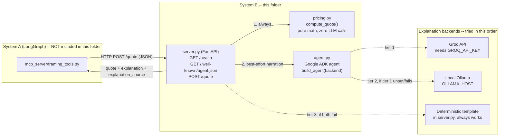

# InMind Framing & Shipping Quote Agent (System B)

A standalone HTTP microservice: give it an artwork's dimensions, medium,
and shipping destination, and it returns a framing, glazing, and
shipping cost estimate, plus a short plain-language explanation of the
quote. Built with **FastAPI** (the HTTP layer) and **Google's Agent
Development Kit (ADK)** (the agent that writes the explanation).

The one rule the whole design hangs on: **the LLM never invents a
number.** All pricing math is deterministic, dependency-free Python.
The agent's only job is to call that math and narrate the result.

---

## What this is

This folder is **"System B"** of a two-agent-systems coursework
project (InMind). "System A" is a separate LangGraph-based pipeline
(not included in this zip) that already handles art-supply search and
invoicing. This service adds a third capability — quoting framing and
shipping for a *finished* piece — as a genuinely independent stack:
different framework (ADK vs. LangGraph), different process, different
dependencies, reachable only over plain HTTP. System A never imports
this code; it POSTs JSON to `/quote`, the same way you would.

## Who it's for

- Whoever is reviewing/grading the "Agent System B" half of the
  assignment.
- A developer on System A (or any other caller) who needs a framing
  quote over HTTP without importing this codebase.
- Anyone using this as a small reference example of: separating
  deterministic business logic from an LLM's narration duties, and a
  paid → free-hosted → local → deterministic fallback chain for LLM
  calls.

## What's actually in this folder

```
framing_agent/
├── agent.py           # Google ADK agent: wraps compute_quote as a tool, writes the explanation
├── pricing.py         # All the arithmetic. Zero LLM calls, zero external imports.
├── server.py          # FastAPI app: GET /health, GET /.well-known/agent.json, POST /quote
├── requirements.txt   # This service's own dependencies (not shared with System A)
├── README.md          # This file
└── __pycache__/       # Stale compiled bytecode from a previous run — safe to delete, not needed to run anything
```

**Important:** this zip is an extract of one subfolder from a larger
monorepo. The original docs for this service refer to a project-root
`docker-compose.yml`, `docker/framing_agent.Dockerfile`, and System-A
files (`agents/`, `mcp_server/`, `local_rag/`) that explain *how this
service fits into the bigger picture*. None of those files are in this
zip. The setup instructions below only use what's actually present
here — see [Known limitations](#known-limitations) for what that
means for Docker Compose.

---

## Architecture



Plain-text version, if Mermaid doesn't render wherever you're reading this:

```
 System A (LangGraph)              HTTP POST /quote               System B -- THIS FOLDER
 framing_tools.py            ───────────────────────────▶         (FastAPI + Google ADK)
 (not included here)         ◀───────────────────────────
                              quote + explanation + source

                                    server.py
                                   /    |    \
                          (always)/     |     \(best-effort)
                                 /      |      \
                         pricing.py     |      agent.py
                        (pure math)     |    (ADK agent)
                                        |         |
                                        |    tier 1: Groq API      (needs GROQ_API_KEY)
                                        |    tier 2: local Ollama  (needs OLLAMA_HOST reachable)
                                        └──> tier 3: fixed string template (always works)
```

**Request lifecycle for `POST /quote`:**

1. `server.py` validates the JSON body into a `QuoteRequest`.
2. It **always** calls `pricing.compute_quote()` first — this is the
   entire source of truth for every dollar figure. If the dimensions
   are invalid, `compute_quote()` returns a structured `error` field
   rather than raising, and the route still returns `200 OK` with that
   error inside the payload.
3. It then attempts to get a natural-language explanation, in order:
   - **Groq**, only if `GROQ_API_KEY` is set — fastest, hosted.
   - **Local Ollama**, always tried next if Groq wasn't configured or
     failed — free, no key, needs `ollama serve` running.
   - **A fixed string template**, built entirely from the numbers
     `compute_quote()` already returned — the guaranteed final tier,
     used if both LLM tiers are unavailable or fail.
4. `explanation_source` in the response tells you which of the three
   actually answered (`"groq"` / `"ollama"` / `"template"`).

---

## Setup — running it standalone

These steps use **only what's in this folder** and were checked
against Python 3.12.

### Prerequisites

- Python 3.10+ (tested here on 3.12.3)
- pip
- *Optional:* a [Groq](https://console.groq.com) API key, for the
  fastest explanation tier
- *Optional:* a local [Ollama](https://ollama.com) install with a
  model pulled (`llama3.2` by default), for the free local tier

Neither optional item is required to run the service — see step 3.

### 1. Install dependencies

From inside this folder:

```bash
python3 -m venv .venv
source .venv/bin/activate        # Windows: .venv\Scripts\activate
pip install -r requirements.txt
```

### 2. Configure environment variables (optional)

> The original version of this README said `cp .env.example .env`,
> but no `.env.example` file ships in this zip (see
> [Known limitations](#known-limitations)). Create `.env` yourself
> instead, if you want either LLM tier:

```bash
cat > .env << 'EOF'
GROQ_API_KEY=your_key_here
OLLAMA_HOST=http://localhost:11434
PORT=8090
EOF
```

Every variable here is optional. With no `.env` at all, `/quote`
still returns the full priced quote on every call — it just falls
through to the deterministic template explanation (or to Ollama,
if you happen to have `ollama serve` running locally already).

### 3. Run it

```bash
uvicorn server:app --host 0.0.0.0 --port 8090
```

(`python3 server.py` also works — the file's `__main__` block calls
`uvicorn.run(...)` itself.)

### 4. Verify it's up

```bash
curl http://localhost:8090/health
```

```json
{
  "status": "ok",
  "service": "framing-agent",
  "groq_configured": false,
  "ollama_host": "http://localhost:11434"
}
```

### 5. Get a quote

```bash
curl -X POST http://localhost:8090/quote \
  -H "Content-Type: application/json" \
  -d '{"width_cm": 40.6, "height_cm": 50.8, "medium": "oil on canvas", "destination_country": "France"}'
```

See [API reference](#api-reference) below for the full response shape
and a verified example.

### Running it via Docker / alongside System A

The original docs describe this service running as the
`framing-agent` container in a project-root `docker-compose.yml`,
called by System A's `mcp_server/framing_tools.py` over the
docker-compose network at `http://framing-agent:8090`. **That compose
file and Dockerfile are not part of this zip**, so Docker Compose
won't work from this folder alone — use the standalone steps above.
If you have the full monorepo, that's where `docker compose up
--build` belongs.

---

## API reference

| Method | Path                        | Purpose                                                              |
|--------|-----------------------------|-----------------------------------------------------------------------|
| GET    | `/health`                   | Liveness probe. Reports whether `GROQ_API_KEY` is set and what `OLLAMA_HOST` is — does **not** actually ping Ollama. |
| GET    | `/.well-known/agent.json`   | A minimal, hand-written A2A-style agent card (name, description, one listed skill). |
| POST   | `/quote`                    | The actual contract — dimensions/medium/destination in, a priced quote + explanation out. |

### `POST /quote`

**Request body:**

| Field                  | Type   | Required | Notes                                                        |
|-------------------------|--------|----------|----------------------------------------------------------------|
| `width_cm`              | float  | yes      | Must end up positive once `compute_quote()` validates it.     |
| `height_cm`             | float  | yes      | Same as above.                                                 |
| `medium`                | string | yes      | Free text, e.g. `"oil on canvas"`, `"watercolor"`. Only used to guess whether glazing is needed. |
| `destination_country`   | string | yes      | Free text country name, matched case-insensitively against a small built-in table. |
| `frame_style`           | string | no       | `"basic wood"` / `"modern metal"` / `"classic ornate"`, or a loose match. Empty/omitted = shop default. |

**Response body** (`quote` mirrors `pricing.compute_quote()`'s return
value exactly):

```json
{
  "quote": {
    "dimensions_cm": {"width": 40.6, "height": 50.8},
    "medium": "oil on canvas",
    "frame": {"style": "basic wood", "style_recognized": false, "cost_usd": 32.9},
    "glazing": {"chosen": "none", "needed": false, "cost_usd": 0.0},
    "shipping": {
      "destination_country": "France", "zone": "international",
      "destination_recognized": true, "estimated_weight_kg": 1.21,
      "cost_usd": 111.94
    },
    "subtotal_usd": 144.84,
    "currency": "USD",
    "disclaimer": "Estimate only -- illustrative pricing for this coursework demo, not a real framing shop's rate card.",
    "generated_at": "2026-08-20T19:28:27+00:00",
    "error": null
  },
  "explanation": "For a 40.6cm x 50.8cm oil on canvas piece, a basic wood frame runs $32.90. No specific frame style was recognized, so the shop's standard default was used. No glazing was included, which is standard for this kind of medium. Shipping to France is estimated at $111.94 (~1.2kg, international zone). Estimated total: $144.84.",
  "explanation_source": "template",
  "generated_at": "2026-08-20T19:28:30+00:00"
}
```

The `quote` object and the `explanation` text above are **real,
verified output** — see [What I actually verified](#what-i-actually-verified-vs-couldnt-test)
below for exactly how. If you have `GROQ_API_KEY` set or Ollama
running, `explanation_source` will read `"groq"` or `"ollama"` instead,
with a paragraph the model wrote — the numbers themselves won't
change, only who narrates them.

An invalid request (e.g. `width_cm: -5`) still returns `200 OK`, with
`quote.error` set to a plain-English reason and every cost field at
`0.0` — never a generic `4xx`/`5xx` for a business-logic problem.

---

## Technical decisions and why

- **Two frameworks, one HTTP boundary, never an import.** System A is
  LangGraph; this is Google ADK. The only contract between them is
  the JSON shape of `POST /quote`. This means either side can be
  developed, deployed, restarted, or taken down independently — the
  same way a retailer's checkout flow calls out to a third-party
  shipping quote API rather than vendoring its code.

- **The LLM never touches a number.** `pricing.py` has no LLM calls
  and no imports from anywhere else in the project. `agent.py`'s ADK
  agent is instructed to call `compute_quote_tool` exactly once and
  then only write a short paragraph — the system prompt explicitly
  forbids stating a price that didn't come from the tool's return
  value. This is a structural guarantee, not a prompting hope: even a
  model that ignores instructions can't invent a price, because it has
  no other source of one.

- **Three-tier explanation fallback (Groq → Ollama → template), never
  a hard dependency on a paid API.** `GROQ_API_KEY` is optional; a
  missing key, a failed call, or a timeout all fall through to local
  Ollama, and a failure there falls through to a fixed string built
  from the same numbers already in the response. The quote itself
  never depends on any of this succeeding.

- **Deliberately loose request validation on dimensions.** `server.py`
  uses plain `float` fields instead of `Field(..., gt=0)`, specifically
  so a bad dimension reaches `compute_quote()`'s own validation and
  its specific, human-readable `error` message, rather than being
  rejected earlier by a generic FastAPI `422`. (See
  [Known limitations](#known-limitations) for a caveat on how far this
  actually reaches.)

- **Fuzzy matching that degrades instead of erroring.** An
  unrecognized frame style falls back to `"basic wood"`; an
  unrecognized destination country falls back to the **most
  expensive** shipping tier (`"international"`), not the cheapest —
  so an unrecognized destination is never silently under-quoted. Both
  cases set a `*_recognized: false` flag so the caller (and the LLM's
  explanation) can say so plainly instead of presenting a guess with
  false confidence.

- **The agent card is intentionally minimal.** `GET
  /.well-known/agent.json` returns enough for a caller to discover
  what this service does and where its one capability lives — it is
  **not** a full implementation of the A2A protocol's task lifecycle
  (no task polling, streaming, or pushed artifacts). System A calls
  `/quote` directly rather than negotiating through this card, which
  is a documented scope cut for this project rather than an oversight.

- **`google-adk` is imported lazily, inside functions, not at module
  load time.** Importing `agent.py` or `server.py` never requires
  `google-adk[extensions]` to be correctly installed — only actually
  building an agent does. Combined with the broad `try/except` around
  every ADK call in `server.py`, a broken or missing ADK install
  degrades to the template explanation tier instead of crashing the
  whole service.

---

## Known limitations

Being upfront about these rather than glossing over them:

- **`server.py` has duplicate route definitions.** `agent_card()` and
  `quote()` are each defined twice in the file (verified by parsing
  the file's AST — both function names appear exactly twice as
  top-level definitions). Both copies of each are byte-for-byte
  identical, so this doesn't change behavior — FastAPI just ends up
  with the route registered twice — but it's leftover copy-paste that
  should be deleted, not intentional design.

- **No `.env.example` ships in this zip**, even though earlier
  documentation for this service referenced one. The setup steps above
  have you create `.env` by hand instead.

- **This zip is a partial extract of a larger monorepo.** The
  Dockerfile and `docker-compose.yml` that would let this run as part
  of the full System A + System B project aren't included here, so
  Docker Compose isn't runnable from this folder alone (see
  [Setup](#setup--running-it-standalone)).

- **The Pydantic-level "any float gets through" claim only half
  holds.** `server.py`'s own comment argues that using plain `float`
  fields (instead of `Field(..., gt=0)`) lets every dimension value
  reach `compute_quote()`'s own validation, including non-numeric
  input. That's true for a *valid-but-non-positive* number like `-5`
  — I confirmed `compute_quote(-5, ...)` returns the intended
  structured error. But for a genuinely non-numeric value like
  `"abc"`, Pydantic's own type coercion on the `float` field almost
  certainly rejects the request with a generic `422` before
  `compute_quote()` ever runs, since Pydantic v2 raises on strings it
  can't parse as numbers. I reasoned this through rather than hitting
  a live server with it (no network in the environment I wrote this
  README in — see below), so treat it as a strong suspicion, not a
  confirmed bug, and worth a five-minute check before relying on it.

- **All pricing is invented for coursework**, clearly labelled via the
  response's own `disclaimer` field. Frame cost, glazing cost, and
  shipping rates are illustrative round numbers, not a real framing
  shop's or carrier's rate card.

- **The shipping-zone table is small (~20 countries)** and hardcoded
  in `pricing.py`. Anything not on that list silently defaults to the
  most expensive ("international") tier — a deliberate choice to
  avoid under-quoting, but it means e.g. most African, South
  American, and South/East Asian countries currently resolve to the
  same flat "international" rate regardless of actual distance.

- **Frame-style matching is a simple substring match**, not a real
  fuzzy-matching library — `"wood"` matches `"basic wood"`, but so
  would any other string that happens to contain or be contained by
  one of the three configured style names. It does correctly set
  `style_recognized: false` on a genuine miss.

- **No authentication, rate limiting, or HTTPS.** `POST /quote` is
  open to anyone who can reach the port. Fine for coursework and for
  a private docker-compose network; not something to expose publicly
  as-is.

- **No automated test suite.** The only checks in this codebase are
  the manual `if __name__ == "__main__":` smoke-checks in `pricing.py`
  and `agent.py` — no `pytest`, no CI configuration.

- **Worst-case latency is un-benchmarked.** If `GROQ_API_KEY` is set
  but the call hangs, and Ollama is also unreachable, `/quote` can
  take up to roughly two back-to-back 6-second timeouts (~12s) before
  falling back to the template. That's a read of the timeout
  constants in `server.py`, not a measured number.

- **`google-adk[extensions]>=1.0.0` has no upper bound pin.** A future
  breaking release of `google-adk` could change or remove
  `LiteLlm`/`Agent` APIs this code depends on without warning.

### What I actually verified vs. couldn't test

I wrote this README without network access, so I want to be precise
about what's actually confirmed versus read-and-reasoned-through:

- **Confirmed by running it:** `pricing.py` has zero external
  dependencies, so I ran `compute_quote()` directly with several
  inputs (a valid oil-on-canvas quote, a watercolor quote to check the
  glazing default and loose frame-style matching, a non-positive
  dimension, and a non-numeric dimension) and confirmed the outputs
  match what the docstrings promise. The example request/response in
  the [API reference](#api-reference) section above is real output
  from this process, not hand-written.
- **Confirmed by stubbing dependencies:** I substituted minimal stand-ins
  for `fastapi`, `pydantic`, and `dotenv` (no network was available to
  actually `pip install` them) so that `server.py` could be imported,
  and called its `_template_explanation()` function directly against a
  real `compute_quote()` result — that's where the exact `explanation`
  text in the API reference example above comes from.
- **Confirmed statically:** all three `.py` files compile cleanly
  (`python -m py_compile`), and the duplicate-route-definition issue
  above was confirmed by parsing `server.py`'s AST, not just by eye.
- **Not tested:** I did not start the actual FastAPI/uvicorn server,
  did not send a real HTTP request over a socket, and did not invoke
  the real ADK agent against either Groq or Ollama — I had no network
  access to install `fastapi`, `uvicorn`, or `google-adk` in the
  environment I used to write this. The setup and verification steps
  above should work as written, but they're your first real end-to-end
  test of this service, not a repeat of one I already ran.
