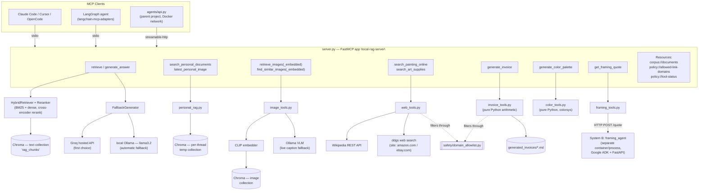

# mcp_server

An MCP (Model Context Protocol) server that exposes a local, retrieval-augmented
painting/art-instruction assistant — plus five supporting tools (image search,
web lookups, invoicing, color theory, framing quotes) — as tools and resources
that any MCP client can call: Claude Code, Cursor, OpenCode, a LangGraph agent
via `langchain-mcp-adapters`, or this project's own multi-agent pipeline.

This file documents `mcp_server/` on its own. It assumes you already have (or
are setting up) the wider project this folder was built against — see
**"Where this folder fits"** immediately below before doing anything else.

---

## 1. What this system does

At its core, this is a **RAG (retrieval-augmented generation) server** over a
local corpus of painting/drawing treatises: `retrieve()` does hybrid
(keyword + vector) search with cross-encoder reranking, `generate_answer()`
turns retrieved chunks into a grounded, cited answer. That's the whole system
described in the original "Phase 1" scope.

On top of that core, this folder adds **thirteen tools and three resources**
in total, grouped by what they're for:

| Group | Tools | Backing module |
|---|---|---|
| Corpus RAG | `retrieve`, `generate_answer` | `retrieval/`, `generation/` (parent project) |
| Per-conversation uploads | `search_personal_documents`, `latest_personal_image` | `personal_rag.py` (parent project) |
| Visual search | `retrieve_images`, `retrieve_images_embedded`, `find_similar_images`, `find_similar_images_embedded` | `image_tools.py` |
| Internet lookups | `search_painting_online`, `search_art_supplies` | `web_tools.py` |
| Commerce | `generate_invoice` | `invoice_tools.py` |
| Color theory | `generate_color_palette` | `color_tools.py` |
| Framing & shipping | `get_framing_quote` | `framing_tools.py` → System B (separate service) |

Plus three resources for introspection: `corpus://documents`,
`policy://allowed-link-domains`, `policy://tool-status`. Full reference in
[section 5](#5-tool--resource-reference).

## 2. Who this is for

- **Specialist agents in the parent project's LangGraph pipeline** —
  `image_qa`, `painting_lookup`, `product_search`, `invoice`, `color_palette`,
  and `framing_quote` nodes (see `agents/README.md` in the parent project)
  each call one or two of these tools rather than reimplementing the logic
  themselves.
- **MCP-native coding assistants** (Claude Code, Cursor, OpenCode) — a
  developer working inside the parent project's repo can point their client
  at this server and ask it to search the corpus directly, without leaving
  their editor.
- **Anyone evaluating this as coursework** — this README is written so a
  grader or reviewer can stand the server up, drive it from two independent
  clients, and check its claims against the code, per the assignment's own
  "no guessed signatures" bar.

It is **not** aimed at production deployment as-is — see
[section 8](#8-known-limitations-read-this-before-you-file-a-bug).

## 3. Where this folder fits

**This zip contains only `mcp_server/`.** It is one component of a larger
project and is not runnable by itself. `server.py` imports directly from,
at minimum:

```
config.py
embeddings/hf_embedder.py
vectorstore/chroma_store.py
retrieval/hybrid_retriever.py
retrieval/reranker.py
generation/fallback_generator.py
safety/domain_allowlist.py
```

...and optionally from `personal_rag.py` and `framing_agent/` (a second,
independently-deployed service — "System B"), none of which ship in this
bundle. If you only have this zip, **get the rest of that project's source
tree first** — the setup below is written assuming you have it.

Expected layout once both are together:

```
project-root/
├── config.py
├── embeddings/
├── vectorstore/
├── retrieval/
├── generation/
├── safety/
├── personal_rag.py            (optional — per-thread uploads)
├── agents/                    (optional — the LangGraph pipeline itself)
├── framing_agent/             (optional — "System B", its own service)
└── mcp_server/                 ← this folder, unchanged, dropped in as-is
    ├── server.py
    ├── image_tools.py
    ├── web_tools.py
    ├── invoice_tools.py
    ├── color_tools.py
    ├── framing_tools.py
    ├── requirements.txt
    └── generated_invoices/
```

`server.py` locates `config.py` itself at import time (checking both
`project-root/config.py` and `project-root/local_rag/config.py`), so
`mcp_server/` can sit at either depth — see `_find_pipeline_root()` in
`server.py` if your layout doesn't match either.

## 4. Architecture



Two design points the diagram doesn't show on its own:

- **Everything below `server.py` in the "new tools" half (image/web/invoice/
  color) is a thin wrapper.** `server.py` owns only the `@mcp.tool()`
  docstring and parameter shape; the real logic lives in the standalone
  module so it can be unit-tested without a running FastMCP process (see
  `test_new_tools_smoke.py`).
- **`framing_tools.py` talks to System B over plain HTTP, never as a Python
  import.** That's deliberate — it's the one place in this architecture where
  two independently-deployable services actually cooperate across a network
  boundary, rather than a function call dressed up as one.

## 5. Tool & resource reference

| Tool | Signature | Returns | External dependency |
|---|---|---|---|
| `retrieve` | `(query, k=5)` | `list[dict]` — text/score/metadata | Chroma (text), HF embedder, reranker |
| `generate_answer` | `(query, chunks)` | `str` | Groq API → local Ollama (`llama3.2`) fallback |
| `search_personal_documents` | `(thread_id, query, k=5)` | `list[dict]` | `personal_rag.py`, per-thread Chroma collection |
| `latest_personal_image` | `(thread_id)` | `dict \| None` | `personal_rag.py` |
| `retrieve_images` | `(query, k=3)` | `list[dict]` | CLIP embedder, image Chroma collection |
| `retrieve_images_embedded` | `(query, k=3)` | `list[dict]` + base64 bytes | same, +5 MB payload cap |
| `find_similar_images` | `(thread_id, k=3)` | `list[dict]` | latest upload + CLIP image-to-image |
| `find_similar_images_embedded` | `(thread_id, k=3)` | `list[dict]` + base64 bytes | same, +5 MB payload cap |
| `search_painting_online` | `(painting_name)` | `dict` — summary + sources | Wikipedia REST API, `ddgs` |
| `search_art_supplies` | `(query, max_results=5)` | `list[dict]` | `ddgs`, restricted to Amazon/eBay |
| `generate_invoice` | `(items, customer_note="")` | `dict` + written `.md` file | none (pure Python) |
| `generate_color_palette` | `(color="", mood="", scheme="")` | `dict` + SVG data-URI swatch | none (pure Python) |
| `get_framing_quote` | `(width_cm, height_cm, medium, destination_country, frame_style="")` | `dict` | HTTP call to System B (`framing_agent`) |

| Resource | Returns | Notes |
|---|---|---|
| `corpus://documents` | Document/chunk counts | Reads the **live** store, not the BM25 snapshot `retrieve()` uses |
| `policy://allowed-link-domains` | The domain allowlist | Transparency only — not needed for retrieval |
| `policy://tool-status` | Two-layer health snapshot | See [section 8](#8-known-limitations-read-this-before-you-file-a-bug) — this one currently has a bug |

Every tool follows the same contract: **never raise.** A missing optional
dependency, an unreachable network, an empty corpus, or a downed sibling
service all degrade to an empty list / `None` / an `"unavailable"` result
with a human-readable reason logged to stderr — never a crash that takes
the rest of the server down with it. `_tool_safety_net()` in `server.py` is
the last line of defense for anything that slips past a module's own
handling.

## 6. Setup instructions

These assume the layout in [section 3](#3-where-this-folder-fits) is in
place. Steps marked **(optional)** unlock one specific tool; skipping them
leaves that tool reporting itself as unavailable, everything else unaffected.

### Step 1 — Python

Python 3.10+. The included `__pycache__/*.cpython-312.pyc` files were
compiled under 3.12, which is the version this was actually tested on.

### Step 2 — Install dependencies

```bash
cd project-root
pip install -r requirements.txt              # the parent project's own deps
pip install -r mcp_server/requirements.txt   # fastmcp, langchain-mcp-adapters,
                                              # requests, ddgs, webcolors
```

### Step 3 — Corpus (required for `retrieve` / `generate_answer`)

Ingest a corpus into the Chroma collection `config.py` points at, using the
parent project's own `pipeline.py` or `stages.py`. Without this, `retrieve()`
returns `[]` (not an error) and `generate_answer()` will generate an
ungrounded answer if you feed it an empty chunk list — ingest first.

For image search specifically, ingest with the `--multimodal` flag; without
it, `retrieve_images*` and `find_similar_images*` always return `[]`.

### Step 4 — Local generation (required for `generate_answer`)

```bash
ollama serve
ollama pull llama3.2
```

`FallbackGenerator` tries a hosted Groq model first and falls back to this
local Ollama model automatically — the exact Groq configuration (API key
env var, model name) is defined in `generation/fallback_generator.py` /
`config.py` in the parent project, not in this bundle, so check those files
if you want the hosted path rather than relying on the local fallback.

### Step 5 — Chroma reachability

`server.py` retries the Chroma connection five times over ~10 seconds before
giving up, to absorb a container-startup race if you're running Chroma as
its own service. Whether it connects locally (embedded persistent client)
or over HTTP, and to which host/port, is controlled by `CHROMA_CLIENT_MODE` /
`CHROMA_SERVER_HOST` / `CHROMA_SERVER_PORT` in `config.py` — not part of this
bundle, so confirm those match wherever your Chroma actually lives.

### Step 6 — **(optional)** Image search

Needs `open-clip-torch`, `torch`, and Ollama reachable for the live VLM
caption fallback. These are expected to already be in the parent project's
own `requirements.txt` if you ran `pipeline.py --multimodal`; not re-pinned
in `mcp_server/requirements.txt` to avoid a second, possibly conflicting
pin of the same heavy packages.

### Step 7 — **(optional)** Extended color names

```bash
pip install webcolors
```

Already covered by `mcp_server/requirements.txt`. Without it,
`generate_color_palette` still works — it falls back to a smaller,
~70-name built-in dictionary.

### Step 8 — **(optional)** Framing quotes (System B)

`get_framing_quote` needs a separate service — `framing_agent/` — running
and reachable. Start it per its own README, then either leave it at the
default `http://localhost:8090` or point this server at it elsewhere:

```bash
export FRAMING_AGENT_URL=http://localhost:8090   # default shown; override if needed
```

Without this running, `get_framing_quote` returns
`{"available": false, "error": "..."}` — never a crash.

### Step 9 — Run the server standalone (sanity check)

```bash
python mcp_server/server.py
```

It sits waiting on stdin/stdout — that's expected, not a hang. `Ctrl+C` to
stop. Startup logs (component construction, which optional modules loaded)
go to **stderr**, deliberately, so they never corrupt the stdio JSON-RPC
stream on stdout.

### Step 10 — Or run it over HTTP instead

```bash
MCP_TRANSPORT=http python mcp_server/server.py
# now listening at http://0.0.0.0:8765/mcp
```

Optionally set `MCP_SERVER_HOST` / `MCP_SERVER_PORT` (ignored in the default
stdio mode). This is what lets the server run as its own container, reachable
by the parent project's `agents/api.py` over the network instead of being
spawned as a stdio subprocess.

### Step 11 — Connect a client: Claude Code / Cursor / OpenCode

**This bundle does not include an `mcp_config.example.json`** despite the
previous version of this README referencing one — that's a real gap in what
shipped, noted here rather than silently worked around. Use this directly,
replacing the path with your own absolute path to `server.py`:

```json
{
  "mcpServers": {
    "local-rag": {
      "command": "python",
      "args": ["/absolute/path/to/project-root/mcp_server/server.py"]
    }
  }
}
```

Save it as `.mcp.json` in your project root (Claude Code — or
`claude mcp add`), `.cursor/mcp.json` (Cursor), or wherever OpenCode expects
it (same JSON shape). **Use an absolute path** — the three clients don't all
set the working directory the same way, and `server.py`'s own path
resolution only helps once it's actually running, not before it's launched.

Restart the client, then prompt it with something that should trigger a
tool call, e.g. *"Use the local-rag tool to search for glazing
techniques."*

### Step 12 — Connect a client: LangGraph via `langchain-mcp-adapters`

Edit the absolute path in `test_langgraph_client.py`, then:

```bash
python mcp_server/test_langgraph_client.py
```

This connects via `MultiServerMCPClient`, lists every tool the server
exposes, and calls `retrieve()` (and, further down the same script,
`generate_answer()` and the `corpus://documents` resource) against it —
proof the same server process serves two independent client stacks.

### Step 13 — Verify without any of the above

The offline smoke test needs no live network, corpus, or Ollama — it
monkeypatches `ddgs`/`requests` and runs the real parsing/filtering logic
inside `image_tools.py` / `web_tools.py` / `invoice_tools.py` against fake
responses:

```bash
python mcp_server/test_new_tools_smoke.py
```

Once the server is actually running against real data, read the
`policy://tool-status` resource from any connected client for a live view of
which components actually constructed — **except see the bug noted for this
resource in section 8.**

## 7. Technical decisions and justifications

- **UTF-8 forced on stdin/stdout/stderr before any other import.** MCP's
  stdio transport treats stdout as the literal wire for JSON-RPC. On
  Windows, a piped (non-console) stdout falls back to the OS locale encoding
  (commonly cp1252) rather than UTF-8; the first non-Latin-1 character
  printed anywhere in the process — a logged query in Arabic, for one
  confirmed case — raised an uncaught `UnicodeEncodeError` outside any
  `@mcp.tool()` call FastMCP could catch, killing the whole process. The
  client sees this as a bare "Connection closed" with nothing in its own log
  explaining why. `reconfigure(encoding="utf-8", errors="replace")` on all
  three streams closes this off entirely, before any library gets a chance
  to print.

- **stdout redirected to stderr in three layers**, not one: around library
  imports, around component construction, and around every individual tool
  call for the server's whole lifetime. Several dependencies (chromadb,
  huggingface_hub, tokenizers) print plain text on import or first use —
  each such line, uncontained, corrupts the JSON-RPC handshake the same way
  the Unicode issue above does. The third layer exists because the first two
  only cover startup; a stray print triggered by a *specific* input during a
  *live* call needs the same protection for the life of the process, not
  just the first few seconds.

- **Every optional tool module is imported defensively, independently of
  every other.** Before this, `image_tools`/`invoice_tools`/`web_tools` were
  plain top-level imports — one missing optional dependency (e.g. `ddgs` not
  installed) raised at module-import time, which is an unhandled exception
  that aborts loading `server.py` entirely. That took down `retrieve()` and
  `generate_answer()` along with everything else, even though nothing about
  the core RAG pipeline was actually broken. Each of the five (`image_tools`,
  `invoice_tools`, `web_tools`, `color_tools`, `framing_tools`) is now
  imported through a helper that catches any import-time failure and
  degrades that module's tools to "unavailable," leaving the rest of the
  server unaffected.

- **The BM25 corpus is a startup-time snapshot, not re-fetched per call.**
  `HybridRetriever` needs the full corpus client-side to build its BM25
  index. Rebuilding that index from scratch on every single `retrieve()`
  call would add real, avoidable latency, so `server.py` snapshots it once
  via `store.get_all()` at startup instead. The direct consequence — you
  must restart the server after re-ingesting documents — is treated as a
  real, stated limitation rather than something to paper over (see
  [section 8](#8-known-limitations-read-this-before-you-file-a-bug)).

- **`retrieve()` over-fetches `k * 3` candidates before reranking down to
  `k`**, rather than mirroring the parent project's `pipeline.py` (which
  reranks the same `top_k` it retrieved — a reorder, not a narrowing). This
  is deliberate: a cross-encoder reranker only adds value if it has more
  candidates to choose from than it returns. It's a design choice worth
  confirming against a labeled eval set for real numbers, not just the
  argument above — that confirmation isn't included here.

- **`retrieve` and `generate_answer` stay two separate tools**, not one
  fused `answer_question` call. This is what lets a multi-hop caller invoke
  `retrieve` several times and `generate_answer` once at the end over the
  combined chunks — fusing them would make that decomposition impossible.

- **Invoice totals and color math are plain Python, never an LLM call.**
  Every line total, subtotal, hex/RGB conversion, and hue rotation in
  `invoice_tools.py` / `color_tools.py` is deterministic arithmetic. A model
  can decide *which* items belong on an invoice or *which* mood maps to
  which starting hue — that parsing happens one layer up, in the calling
  specialist — but it never gets to decide what the numbers add up to.

- **Every outbound link is checked against a small, hand-curated domain
  allowlist** (`safety/domain_allowlist.py`), and `generate_invoice`
  re-checks each item's URL independently of whatever filtering
  `search_art_supplies` already did when the item was first found — an item
  reaching the invoice tool arrived via a specialist's own message history,
  one hop removed from the original search result, so re-checking here is
  cheap insurance against a link having been altered in between.

- **`framing_tools.py` reaches System B over plain HTTP, never as a Python
  import**, in either direction. That boundary is the actual point being
  exercised: two independently deployable services cooperating across a
  real network call, not a function call dressed up as one. Every failure
  mode on that call — connection refused, timeout, non-2xx, malformed JSON —
  degrades to the same `{"available": false, "error": ...}` shape rather
  than propagating.

- **Image responses come in a path-based and a base64-embedded pair**
  (`retrieve_images` / `retrieve_images_embedded`, and the `find_similar_*`
  equivalents) rather than one tool with a flag. This is additive — the
  original path-based tools and every existing caller are untouched: use the
  `_embedded` variant only when the caller actually needs pixels, not just a
  pointer to them, since embedding is capped at 5 MB per image to avoid
  bloating a payload traveling over the same stdio channel a stray print can
  already corrupt.

## 8. Known limitations (read this before you file a bug)

Stated directly, on purpose — a report that names these is worth more than
one that quietly works around them.

- **This zip is not standalone.** It is the `mcp_server/` subfolder of a
  larger project and imports directly from `config.py`, `embeddings/`,
  `vectorstore/`, `retrieval/`, `generation/`, and `safety/`, none of which
  are included here. Section 3 above spells out exactly what has to sit
  alongside it.

- **`policy://tool-status` currently raises an error.** Its
  `pipeline_components.image_search` field calls
  `image_tools.diagnostic_status()` — but `image_tools.py` defines no
  function by that name (checked against every function actually defined in
  that module; every *other* module-function call in `server.py` does
  resolve correctly). Reading this resource against a live server will
  currently throw an `AttributeError`, uncaught, because `@mcp.resource()`
  functions aren't wrapped by the same `_tool_safety_net()` that protects
  `@mcp.tool()` calls. Until `image_tools.py` gains a real
  `diagnostic_status()` (or the call is removed), don't rely on this
  resource for the image-search health check its own docstring promises —
  the `image_tools` / `invoice_tools` / `web_tools` / `color_tools` /
  `personal_rag` top-level "available"/"unavailable" fields on the same
  resource are unaffected and do work.

- **The BM25 snapshot goes stale.** If you ingest new documents while this
  server is running, `retrieve()` won't see them until you restart the
  process. `corpus://documents` always reflects the live store, so it can
  briefly disagree with what `retrieve()` can actually find — a real,
  intentional tradeoff (see section 7), not an oversight, but worth knowing
  before you assume the two are always in sync.

- **`search_art_supplies`'s prices are a best-effort regex pulled from a
  search-result snippet, not a live price lookup.** It can be stale, wrong,
  or simply absent. A production version would use Amazon's Product
  Advertising API or eBay's Browse API, both of which require developer
  keys — ruled out here by this project's own "everything free and keyless"
  constraint.

- **The domain allowlist vets domains, not pages.** It guarantees a
  returned link's *domain* is on a short, hand-curated, reputable list — a
  materially weaker claim than "this specific page is accurate or fairly
  priced." It is not a dynamic reputation classifier.

- **`retrieve_images*` and `find_similar_images*` need a `--multimodal`
  ingest.** Without it, or without `open-clip-torch`/`torch` installed, they
  return `[]` — indistinguishable, from the caller's side, from "nothing
  relevant was found." Check `policy://tool-status`'s `image_tools` field
  (not the currently-broken `image_search` sub-field, see above) to tell the
  two apart.

- **`get_framing_quote` depends on a second, separately-run service.** If
  `framing_agent/` (System B) isn't started, this tool degrades cleanly to
  `available: false` — but there is no quote, degraded or otherwise, without
  it actually running.

- **No authentication on the HTTP transport.** `MCP_TRANSPORT=http` opens a
  plain network port with every tool reachable by anyone who can reach it —
  including `generate_invoice` (writes files to disk) and the two
  internet-search tools. Fine for local development or a trusted Docker
  network; not something to expose publicly as-is.

- **`ddgs` has no SLA.** It's free and keyless, which is also exactly why it
  can rate-limit, change its response shape, or go away without notice.
  Every call site treats a `ddgs` failure as "return empty," never fatal —
  but that means `search_painting_online` and `search_art_supplies` can go
  quiet with no warning beyond a stderr log line.

- **Test coverage is uneven.** `test_new_tools_smoke.py` covers
  `image_tools.py`, `web_tools.py`, and `invoice_tools.py` with a mocked
  network — it does not touch `color_tools.py`, `framing_tools.py`,
  `personal_rag.py`, or the core `retrieve`/`generate_answer` path at all.
  `test_langgraph_client.py` is a live integration probe against a real
  corpus and a real running Ollama, not an automated test — it's meant to be
  run and watched, not asserted on in CI.

- **The Windows stdout/Unicode fixes were written reactively**, against a
  specific confirmed crash (Arabic text in a logged query). The underlying
  class of bug — any library, at any depth, printing something unexpected
  through this same stdio channel — is mitigated in three layers (section 7)
  but not provably eliminated; a not-yet-seen case could still exist.

- **`mcp_config.example.json`, referenced by the previous version of this
  README, isn't in this bundle.** The working config is now given directly
  in [section 6, step 11](#step-11--connect-a-client-claude-code--cursor--opencode)
  instead of pointing at a file that doesn't exist here.

## 9. File map

```
mcp_server/
├── server.py              FastMCP app — 13 tools, 3 resources, all startup wiring
├── image_tools.py         CLIP retrieval + VLM captioning backing image tools
├── web_tools.py           Wikipedia + ddgs backing internet-lookup tools
├── invoice_tools.py       Pure-Python invoice arithmetic + markdown rendering
├── color_tools.py         Pure-Python color math (colorsys) + named-color lookup
├── framing_tools.py       HTTP client for System B (framing_agent), separate service
├── requirements.txt       This folder's own deps, additive to the parent project's
├── generated_invoices/    Output of generate_invoice() — gitignored except .gitkeep
├── test_new_tools_smoke.py   Offline smoke test, mocked network, no live deps
├── test_langgraph_client.py  Live integration probe via langchain-mcp-adapters
└── README.md               this file
```
